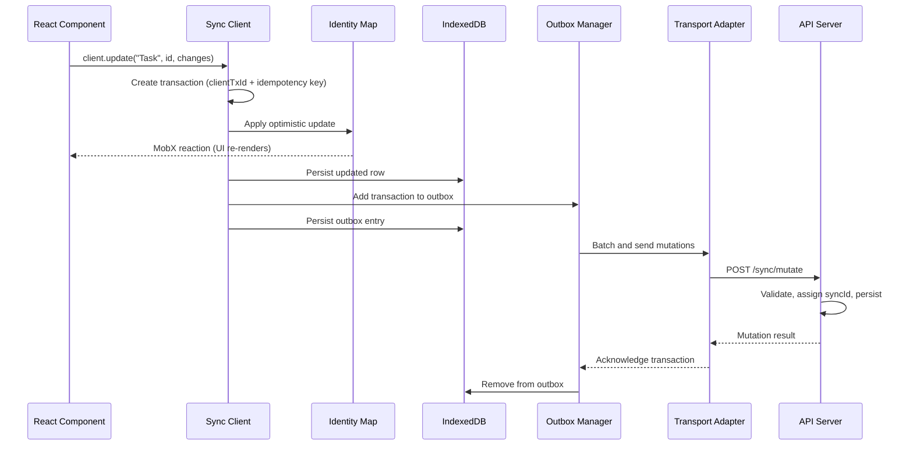
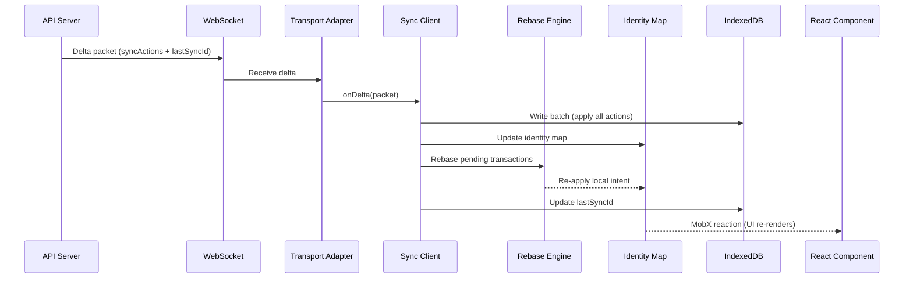
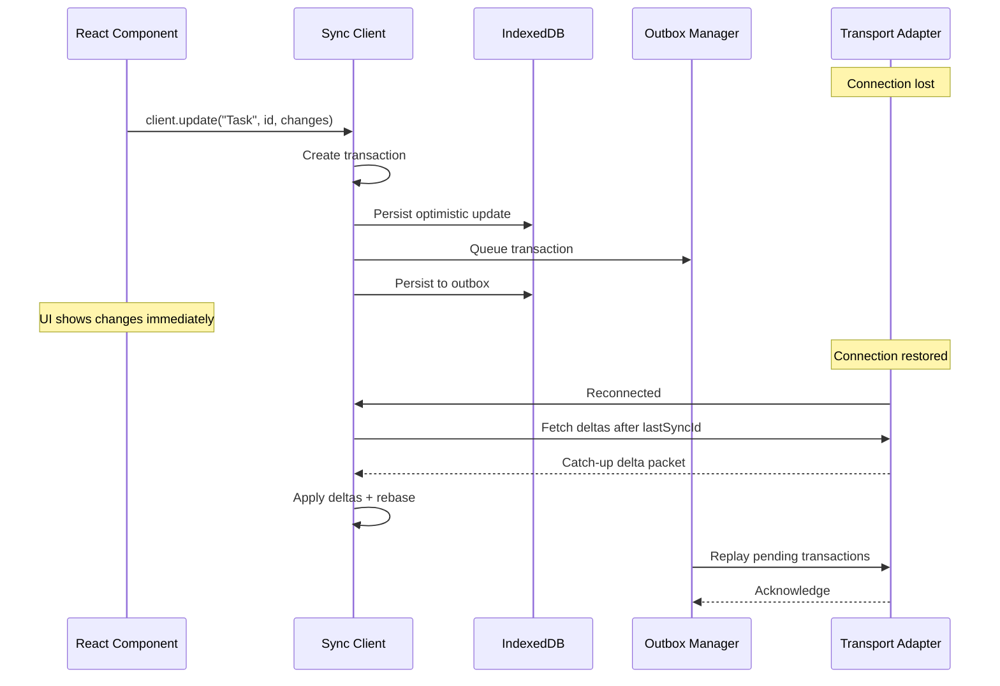
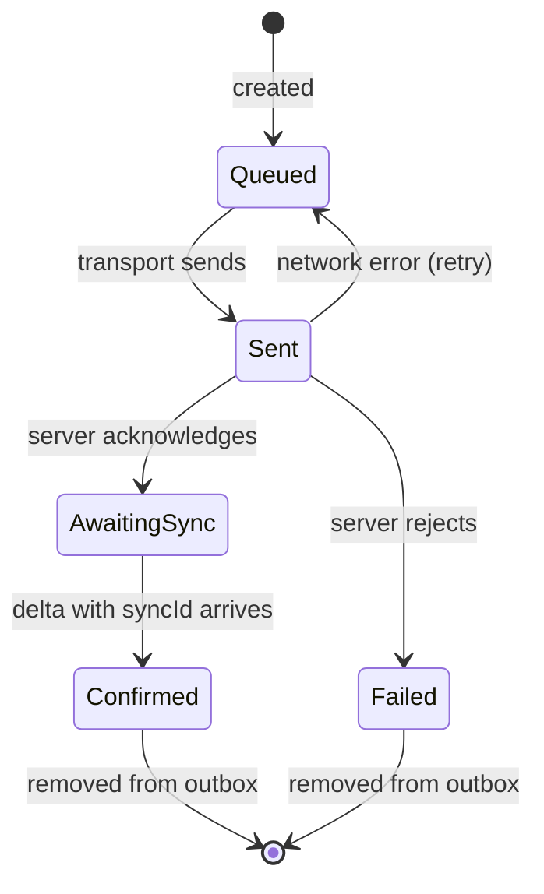

Understanding how data moves through Strata Sync is key to building robust applications. There are two primary flows: **client writes** (mutations going to the server) and **server pushes** (deltas coming from the server).

## Client write flow

When a user makes a change (creating, updating, or deleting a record), the mutation follows this path:

### Step by step

1. **Transaction creation** -- The client creates a `Transaction` object containing the model name, model ID, action type, changed fields, original values, and a unique idempotency key.

2. **Optimistic application** -- The client applies the change immediately to the in-memory identity map. MobX notifies observing components, so the UI updates with zero latency.

3. **Local persistence** -- The client writes the updated model row to IndexedDB. The client also persists the transaction to the outbox store so it survives page reloads.

4. **Outbox batching** -- The outbox manager collects transactions and batches them based on the configured `batchDelay` (default 50ms). This reduces network overhead for rapid sequential edits.

5. **Network send** -- The transport adapter sends the batch to the server. Each transaction includes its idempotency key for safe retry.

6. **Server processing** -- The server validates the mutation, assigns a `syncId`, persists the change to the database, and broadcasts a delta to all connected clients.

7. **Acknowledgment** -- The server responds with the assigned `syncId` for each transaction. The outbox manager removes acknowledged transactions from the persistent outbox.

## Server push flow

When another client makes a change (or the server processes our own mutation), the delta arrives through the WebSocket subscription:

### Step by step

1. **Delta receipt** -- The transport adapter receives a `DeltaPacket` containing one or more sync actions and a `lastSyncId` watermark.

2. **Batch write** -- The client applies all actions in the packet to IndexedDB in a single atomic write batch. This ensures the local store is always consistent.

3. **Identity map update** -- The client updates in-memory model instances with the new field values. Inserts create new instances; updates modify existing ones; deletes remove instances from the map.

4. **Rebase** -- If any of the changed models have pending local transactions in the outbox, the rebase engine runs to reconcile server state with local intent.

5. **Watermark advance** -- The client updates `lastSyncId` to the packet's watermark, both in memory and in IndexedDB.

6. **UI reaction** -- MobX detects the changed observable properties and triggers re-renders in components that read those fields.

## Conflict resolution (rebase)

When a server delta updates a model that has a pending local transaction, a conflict exists. Strata Sync resolves this using **field-level last-writer-wins rebase**.

### How rebase works

Each pending update transaction stores:

- `patch` -- The fields the user wants to change and their desired values.
- `original` -- The field values at the time the user started editing.

When a server delta updates the same model:

1. For each field changed by the server delta:
   - If the pending transaction also changes that field, the rebase strategy determines the outcome.
   - If the pending transaction doesn't change that field, the client accepts the server value without conflict.

2. The client updates the `original` values in the pending transaction to reflect the new server state.

3. The client re-applies the pending transaction's desired values to the in-memory model so the UI continues to show the user's intent.

### Rebase strategies

The `rebaseStrategy` option on `SyncClientOptions` controls how field-level conflicts are resolved:

| Strategy        | Behavior                                                                                                                                |
| --------------- | --------------------------------------------------------------------------------------------------------------------------------------- |
| `"server-wins"` | The client accepts the server value. The pending transaction's conflicting field is dropped. This is the default.                       |
| `"client-wins"` | The client preserves the local value. The pending transaction keeps its desired value and will overwrite the server value on next sync. |
| `"merge"`       | The client calls a merge function to produce a combined value. Useful for counters, sets, or custom merge logic.                        |

### Example

Consider this scenario:

1. User A changes `task.title` from `"Bug"` to `"Bug Fix"` (pending local transaction).
2. User B changes `task.status` from `"open"` to `"closed"` (arrives as server delta).

The rebase engine sees:

- Server delta changes `status`. The pending transaction doesn't touch `status`, so the client accepts it without conflict.
- The pending transaction changes `title`. The server delta doesn't touch `title`, so the client preserves the local intent.

Result: The task shows `title: "Bug Fix"` (local intent) and `status: "closed"` (server value). When the pending transaction syncs, the client sends only the `title` change to the server.

Now consider a true conflict:

1. User A changes `task.title` from `"Bug"` to `"Bug Fix"` (pending).
2. User B changes `task.title` from `"Bug"` to `"Critical Bug"` (server delta).

With `"server-wins"` (default): The title becomes `"Critical Bug"`. The client drops the pending transaction's title change.

With `"client-wins"`: The title stays `"Bug Fix"` in the UI. The pending transaction retains the title change and the client sends it to the server.

## Offline and reconnect flow

We designed Strata Sync to work offline by default.

### Key behaviors during offline

1. **Reads continue** -- The client reads all data from the local IndexedDB store. The UI is fully functional.
2. **Writes are queued** -- The client applies mutations optimistically and stores them in the persistent outbox.
3. **Outbox survives reloads** -- Even if the user closes and reopens the app, IndexedDB preserves pending transactions.
4. **Reconnect catch-up** -- On reconnection, the client first fetches all missed deltas to bring the local store up to date, then replays the outbox.
5. **Idempotent retry** -- Outbox transactions use idempotency keys, so the client can safely retry a transaction that may have been sent but not acknowledged before the disconnect.

## Transaction lifecycle

Each transaction in the outbox goes through a defined state machine:

| State          | Description                                                                                                                                      |
| -------------- | ------------------------------------------------------------------------------------------------------------------------------------------------ |
| `Queued`       | The transaction waits in the outbox to be sent.                                                                                                  |
| `Sent`         | The client sent the transaction to the server but the server has not yet acknowledged it.                                                        |
| `AwaitingSync` | The server acknowledged the mutation, but the corresponding delta has not yet arrived.                                                           |
| `Confirmed`    | The client applied the delta containing this transaction's `syncId`. The client removes the transaction from the outbox.                         |
| `Failed`       | The server rejected the mutation (validation error, permission denied). The client removes the transaction and rolls back the optimistic update. |
