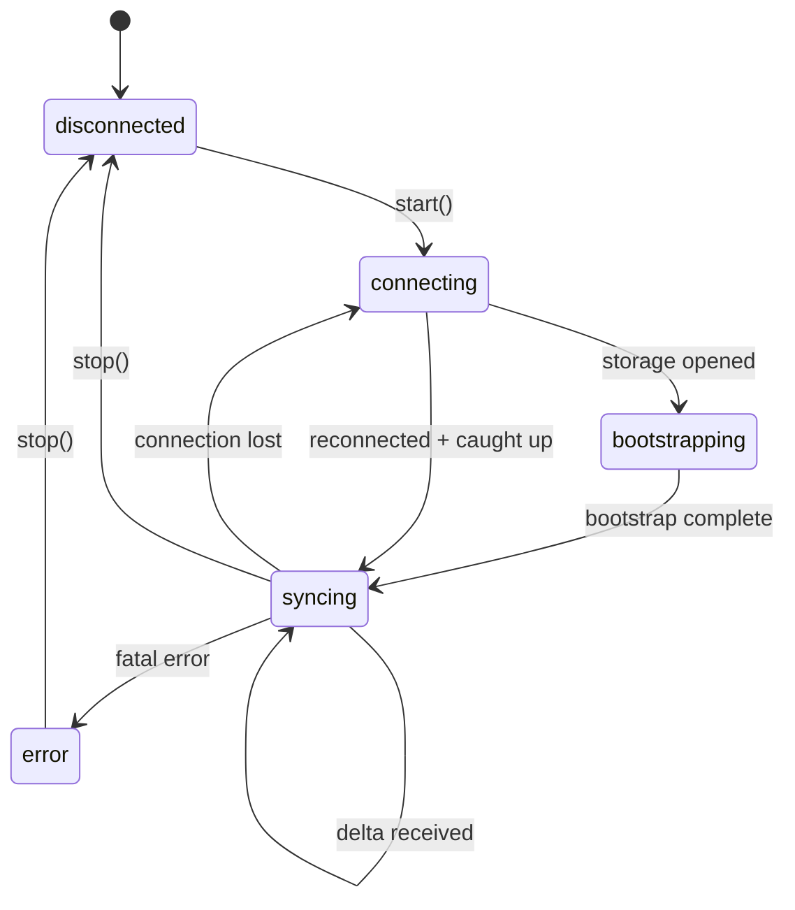

Strata Sync uses a **server-sequenced** sync model. The server assigns a monotonically increasing `syncId` to every committed change, creating a single global ordering that all clients follow.

## The sync log

The core abstraction is a monotonic append-only log of **sync actions**. Each action represents a single change to a single model row:

| Field       | Description                                                                                             |
| ----------- | ------------------------------------------------------------------------------------------------------- |
| `id`        | The `syncId` -- a monotonically increasing integer assigned by the server.                              |
| `modelName` | Which model was changed (such as `"Task"` or `"User"`).                                                 |
| `modelId`   | The primary key of the affected row.                                                                    |
| `action`    | The type of change: `"I"` (insert), `"U"` (update), `"D"` (delete), `"A"` (archive), `"V"` (unarchive). |
| `data`      | The changed fields (for inserts and updates) or `null` (for deletes).                                   |
| `groups`    | Optional sync group memberships for access control.                                                     |

A **delta packet** bundles one or more sync actions with a `lastSyncId` watermark:

```ts
interface DeltaPacket {
  lastSyncId: number;
  actions: SyncAction[];
}
```

The client tracks its own `lastSyncId`. After applying a delta packet, the client advances its watermark to `packet.lastSyncId`. This is the only mechanism by which confirmed state advances on the client.

## Client state machine

The sync client follows a well-defined lifecycle:



The actual `SyncClientState` type has five values: `"disconnected"`, `"connecting"`, `"bootstrapping"`, `"syncing"`, and `"error"`. Reconnection and catch-up happen within the `connecting` and `syncing` states respectively.

### 1. Connecting

The client opens the local storage (IndexedDB). It reads the stored `schemaHash` and `lastSyncId`.

- If the stored schema hash doesn't match the current schema, the client clears local data and performs a full bootstrap.
- If the schema matches and data exists, the client performs a local bootstrap from IndexedDB, then catches up with deltas from the server.

### 2. Bootstrapping

The bootstrap process loads the initial dataset into the local store and identity map.

**Full bootstrap** (no local data or schema mismatch):

1. The client calls the server's bootstrap endpoint with the list of `"instant"` load strategy models.
2. The server responds with an NDJSON stream of model rows.
3. The client writes each row to IndexedDB and hydrates it into the in-memory identity map.
4. The final metadata line includes the server's `lastSyncId`, which becomes the client's watermark.

**Local bootstrap** (existing local data):

1. The client reads all model rows from IndexedDB into the identity map.
2. The client fetches deltas from the server starting at the stored `lastSyncId`.
3. The client applies deltas to bring the local store up to date.

### 3. Syncing

The client subscribes to the server's delta stream (WebSocket). As new sync actions arrive:

1. The client applies actions to IndexedDB in a single write batch.
2. The client updates in-memory model instances.
3. The client rebases pending local transactions against the new server state.
4. `lastSyncId` advances.
5. MobX reactions fire, updating the UI.

### 4. Reconnecting and catch-up

If the WebSocket connection drops, the client transitions back to the `connecting` state:

1. The client attempts to reconnect with exponential backoff.
2. On reconnection, the client fetches all deltas after its stored `lastSyncId` via the HTTP catch-up endpoint.
3. Once caught up, the client transitions back to `syncing` and resumes the WebSocket delta stream.
4. The client retries any outbox transactions that were pending or sent-but-unacknowledged.

## Bootstrap modes

The `bootstrapMode` option on `SyncClientOptions` controls the initial load strategy:

| Mode      | Behavior                                                                                                       |
| --------- | -------------------------------------------------------------------------------------------------------------- |
| `"auto"`  | Full bootstrap if no local data exists; local bootstrap with delta catch-up otherwise. This is the default.    |
| `"full"`  | Always perform a full bootstrap from the server, ignoring any existing local data.                             |
| `"local"` | Bootstrap from local data only. Useful when offline or when you want to display cached data before connecting. |

## Model load strategies

Each model class declares a load strategy that controls when and how it's synced:

| Strategy                | Description                                                                                                                                            |
| ----------------------- | ------------------------------------------------------------------------------------------------------------------------------------------------------ |
| `"instant"`             | The client includes this in the initial bootstrap. The full dataset syncs eagerly. Best for small, frequently accessed models (users, teams, labels).  |
| `"lazy"`                | Not included in bootstrap. The client loads this from the server on first access via `ensureModel()` or `useModel()`. Cached locally after first load. |
| `"partial"`             | The client loads this by index values. For example, load all comments for a specific task. The client tracks this by partial index coverage.           |
| `"explicitlyRequested"` | Never loaded automatically. The client only fetches this when you explicitly request it.                                                               |
| `"local"`               | Client-only data that never syncs to the server. Useful for UI state or drafts.                                                                        |

## Idempotency

Every outgoing mutation carries an idempotency key composed of `clientId + clientTxId`. This handles the case where the app crashes or the network drops after sending a mutation but before receiving the server's acknowledgment. Resending the same transaction is safe because the server uses the idempotency key to deduplicate.

```ts
// Idempotency key structure
{
  clientId: "c_abc123",      // Unique per browser/device
  clientTxId: "tx_def456",   // Unique per transaction
}
```

The client generates `clientId` once per device and persists it in IndexedDB. The client generates `clientTxId` for each new transaction.

## Schema hash and migrations

The `computeSchemaHash()` function produces a deterministic hash from all registered model definitions (model names, field types, relation types, load strategies). This hash serves two purposes:

1. **Bootstrap cache busting** -- If the schema changes between deploys, the client detects the mismatch and triggers a full re-bootstrap instead of applying deltas against an incompatible schema.
2. **Local database migration** -- When the stored schema hash differs from the computed hash, the client can decide whether to migrate in place or wipe and re-bootstrap.

## Wire primitives

The transport layer uses these standard wire formats:

**Model row** (bootstrap and batch load):

```json
{ "__class": "Task", "id": "abc", "title": "Bug fix", "status": "open" }
```

**Sync action** (delta stream):

```json
{
  "id": 42,
  "modelName": "Task",
  "modelId": "abc",
  "action": "U",
  "data": { "status": "closed", "updatedAt": "2025-01-15T00:00:00Z" }
}
```

**Mutation request** (outbox to server):

```json
{
  "transactions": [
    {
      "clientTxId": "tx_def456",
      "clientId": "c_abc123",
      "modelName": "Task",
      "modelId": "abc",
      "action": "update",
      "data": { "status": "closed" },
      "original": { "status": "open" }
    }
  ]
}
```

## Sync groups and partial replication

Sync groups control which data is visible to each client. Every model row can belong to one or more groups (workspace IDs, team IDs, user IDs). The server filters bootstrap, batch, and delta responses by the client's subscribed groups.

When group membership changes:

1. The server emits a group membership change event.
2. The client triggers a partial bootstrap for newly added groups.
3. Data from removed groups can be garbage-collected from the local store.

This enables multi-tenant applications where each user sees only the data they have access to, without downloading the entire dataset.
