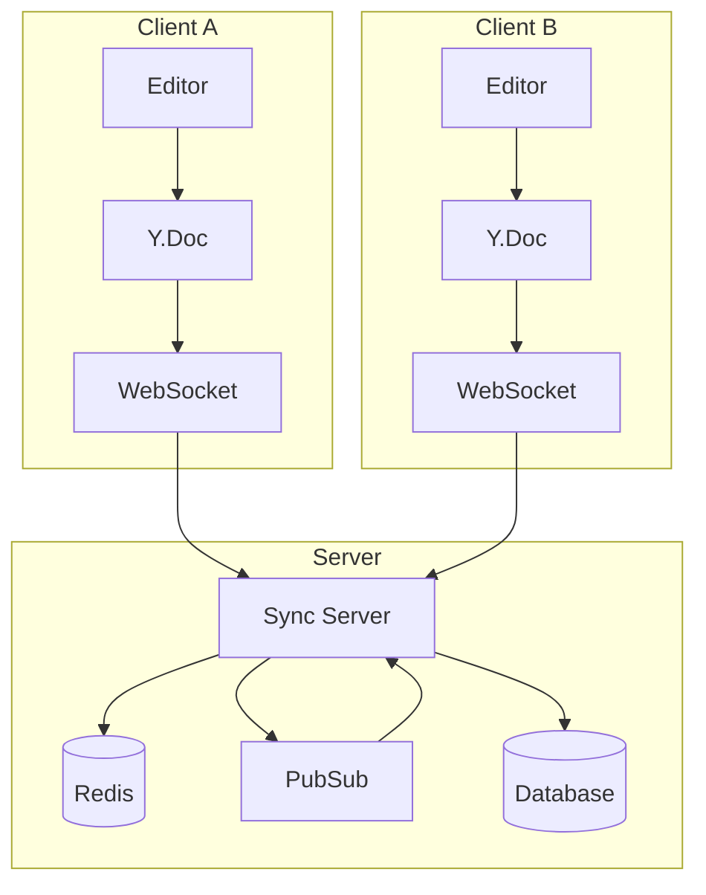
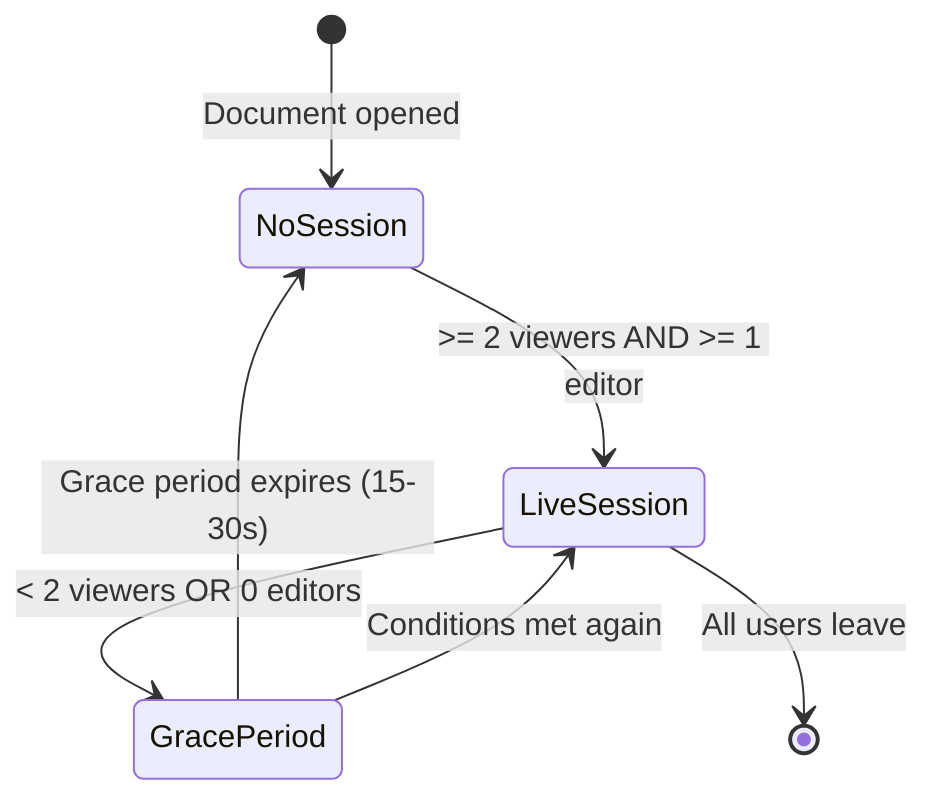

Strata Sync uses [Yjs](https://yjs.dev), a CRDT (Conflict-free Replicated Data Type) framework, to power real-time collaborative editing. Unlike Operational Transform (OT), CRDTs guarantee convergence without a central ordering server, making them a natural fit for an offline-first architecture.

This guide walks through setting up collaborative editing from scratch, including document management, presence tracking, and editor integration.

## CRDT approach vs. Operational Transform

| Aspect                  | CRDT (Yjs)                          | OT (Google Docs-style)                                |
| ----------------------- | ----------------------------------- | ----------------------------------------------------- |
| Central server required | No -- peers can merge independently | Yes -- server must order operations                   |
| Offline support         | Native -- merge when reconnected    | Difficult -- operations must be transformed in order  |
| Convergence guarantee   | Mathematical -- all peers converge  | Algorithmic -- depends on correct transform functions |
| Complexity              | In the data structure               | In the transformation logic                           |
| Strata Sync choice      | Yjs CRDTs for collaborative fields  | Standard sync for non-collaborative fields            |

Strata Sync takes a hybrid approach: regular model fields use the server-sequenced sync protocol with last-writer-wins semantics, while rich-text or collaborative fields use Yjs CRDTs for character-level merge resolution.

## Architecture overview



Key design decisions:

- **Live sessions are demand-driven**: The server starts a full editing session only when at least one user is actively editing and another user is viewing the same document. This reduces server resource usage by approximately 96% compared to always-on sessions.
- **Existing WebSocket reused**: Yjs updates piggyback on the same WebSocket connection used for regular sync, avoiding additional connections.
- **Standard sync as durability backbone**: Each client continues to sync periodically via the standard protocol. If the live editing subsystem goes down, no data is lost.

## Setting up YjsDocumentManager

The `YjsDocumentManager` from `@stratasync/y-doc` manages Yjs document instances and their connection to the sync server.

```ts
import { YjsDocumentManager } from "@stratasync/y-doc";
import type { YjsTransportAdapter } from "@stratasync/transport-graphql";

// The transport adapter provides the WebSocket connection
// It is typically obtained from the sync client's transport
const yjsTransport: YjsTransportAdapter = transport.createYjsAdapter();

const documentManager = new YjsDocumentManager({
  transport: yjsTransport,
});
```

### Getting a document

Call `getDocument` to obtain a Yjs `Y.Doc` for a specific model instance. The manager handles creating, caching, and connecting documents.

```ts
import type { DocumentKey } from "@stratasync/y-doc";

const docKey: DocumentKey = {
  entityType: "Task",
  entityId: taskId,
  fieldName: "description",
};

// Get or create a Y.Doc for a specific task's description
const doc = documentManager.getDocument(docKey);

// Access the shared text type
const yText = doc.getText("content");
```

The `"content"` key is the shared Y.Text type name used for all collaborative fields. Multiple clients accessing the same document ID receive the same shared state.

### Connection management

```ts
// Connect to start receiving/sending updates
documentManager.connect(docKey);

// Check connection state
const state = documentManager.getConnectionState(docKey);
// "disconnected" | "connecting" | "syncing" | "connected"

// Disconnect when done
documentManager.disconnect(docKey);
```

## Using the useYjsDocument hook

In React, the `useYjsDocument` hook from `@stratasync/react` provides a reactive interface to Yjs documents.

```tsx
"use client";

import { useYjsDocument } from "@stratasync/react";

export function CollaborativeEditor({ taskId }: { taskId: string }) {
  const { doc, connectionState, content } = useYjsDocument({
    entityType: "Task",
    entityId: taskId,
    fieldName: "description",
  });

  if (connectionState === "connecting") {
    return <p>Connecting to editing session...</p>;
  }

  if (!doc) {
    return <p>Loading document...</p>;
  }

  // `content` is a reactive string derived from doc.getText("content")
  // `doc` is the raw Y.Doc for editor binding
  return (
    <div>
      <p>Status: {connectionState}</p>
      <Editor doc={doc} />
    </div>
  );
}
```

## Presence tracking with useYjsPresence

Presence tracking shows who is viewing or editing a document, where their cursor is, and their selection state.

```tsx
"use client";

import { useYjsPresence } from "@stratasync/react";

export function PresenceBar({ taskId }: { taskId: string }) {
  const { startViewing, stopViewing, isViewing, isEditing } = useYjsPresence({
    entityType: "Task",
    entityId: taskId,
    fieldName: "description",
  });

  // Note: Individual session information is available via useYjsDocument's
  // participants field. This example shows presence tracking only.
  return (
    <div className="flex gap-2">
      <div className="text-sm">Viewing: {isViewing ? "Yes" : "No"}</div>
      <div className="text-sm">Editing: {isEditing ? "Yes" : "No"}</div>
    </div>
  );
}
```

### Managing presence state

The `useYjsPresence` hook provides methods to signal viewing and editing state:

```ts
const { startViewing, stopViewing, focus, blur, isViewing, isEditing } =
  useYjsPresence({
    entityType: "Task",
    entityId: taskId,
    fieldName: "description",
  });

// Start viewing when the user navigates to the document
startViewing();

// Signal editing when the user focuses an input
focus(); // Automatically calls startViewing() if not already viewing

// Signal blur when the user leaves the input
blur();

// Stop viewing when the user navigates away
stopViewing();
```

The `YjsPresenceManager` behind the scenes handles these signals and broadcasts them to other participants. You can also use `trackFocus` and `trackVisibility` options to automatically handle these events via a ref callback.

## Message protocol

Yjs messages are transported inside the existing WebSocket connection using type-prefixed envelopes. The protocol follows the standard Yjs sync protocol:

### Sync handshake

When a client joins a live session, it exchanges state vectors with the server to converge:

1. **Sync Step 1**: Client sends its state vector to the server.
2. **Sync Step 2**: Server responds with the diff (updates the client is missing).
3. **Incremental updates**: After the handshake, both sides send incremental updates as edits occur.

### Message types

| Message prefix   | Purpose                                          |
| ---------------- | ------------------------------------------------ |
| `yjs_sync_step1` | Client sends state vector                        |
| `yjs_sync_step2` | Server sends missing updates                     |
| `yjs_update`     | Incremental CRDT update (binary, base64-encoded) |
| `doc_view`       | Client started/stopped viewing a document        |
| `doc_focus`      | Client started/stopped editing (has input focus) |
| `session_state`  | Session metadata (active viewers, editors)       |
| `live_editing_*` | Live editing session lifecycle events            |

### Example update envelope

```json
{
  "type": "yjs_update",
  "docId": "task-abc-123",
  "payload": "AQECBAIBAQ==",
  "clientId": "client-xyz"
}
```

Updates are binary Yjs payloads, base64-encoded when the WebSocket envelope uses JSON.

## Session lifecycle

Live editing sessions are resource-intensive, so the server only creates them when needed:



When no live session exists, each client operates independently using the standard sync protocol. Each client sends edits as CRDT deltas rather than full document content, so when a live session starts, all clients can merge seamlessly.

## Integration with rich-text editors

### Tiptap

[Tiptap](https://tiptap.dev) is a headless rich-text editor built on ProseMirror that has first-class Yjs support via `@tiptap/extension-collaboration`.

```tsx
"use client";

import { useEditor, EditorContent } from "@tiptap/react";
import StarterKit from "@tiptap/starter-kit";
import Collaboration from "@tiptap/extension-collaboration";
import CollaborationCursor from "@tiptap/extension-collaboration-cursor";
import { useYjsDocument } from "@stratasync/react";

export function TiptapEditor({ taskId }: { taskId: string }) {
  const { doc, connectionState, participants } = useYjsDocument({
    entityType: "Task",
    entityId: taskId,
    fieldName: "description",
  });

  const editor = useEditor(
    {
      extensions: [
        StarterKit.configure({
          // Disable default history -- Yjs handles undo/redo
          history: false,
        }),
        Collaboration.configure({
          document: doc ?? undefined,
        }),
        CollaborationCursor.configure({
          provider: null, // Strata Sync handles transport
          user: {
            name: "Current User",
            color: "#3b82f6",
          },
        }),
      ],
    },
    [doc]
  );

  if (connectionState === "connecting" || !doc) {
    return <p>Connecting...</p>;
  }

  return (
    <div>
      <div className="flex gap-1 mb-2">
        {participants.map((p) => (
          <span
            key={p.userId}
            className="text-xs px-2 py-1 rounded bg-blue-100"
          >
            {p.userId} {p.isEditing && "(editing)"}
          </span>
        ))}
      </div>
      <EditorContent editor={editor} />
    </div>
  );
}
```

### ProseMirror (direct)

If you use ProseMirror directly (without Tiptap), bind using `y-prosemirror`:

```ts
import { ySyncPlugin, yCursorPlugin, yUndoPlugin } from "y-prosemirror";

const plugins = [
  ySyncPlugin(yText),
  yCursorPlugin(awareness),
  yUndoPlugin(),
  // ...other ProseMirror plugins
];
```

The `yText` and `awareness` objects come from the Yjs document and presence manager respectively.

## Offline collaboration

One of the key advantages of the CRDT approach is seamless offline support:

1. A user edits a document while offline. The client applies changes to the local `Y.Doc` and buffers them.
2. The standard sync mechanism continues to send CRDT deltas (not full document content) to the server when connectivity returns.
3. If another user edited the same document while the first user was offline, both sets of changes merge automatically -- character by character, without conflicts.
4. The server diffs API writes that send full document content against the current state, producing minimal CRDT updates that integrate with ongoing editing sessions.

This means a user can work on an airplane, and when they land, their changes merge cleanly with everything that happened while they were offline.

## Server-side update handling

Every CRDT update the server receives goes through:

1. **Authentication**: The server verifies the client has write permission for the document.
2. **Validation**: The server checks size limits and decodes the binary payload.
3. **Application**: The server applies the update to the in-memory `Y.Doc` (or a short-lived instance from the latest snapshot).
4. **Distribution**: The server appends to the Redis update log and publishes via PubSub to other sync servers.
5. **Persistence**: The server periodically flushes the derived content to the database so non-live users receive updates via the standard sync protocol.

Redis stores a compact snapshot plus a bounded log of recent updates. Compaction happens when the log exceeds a size or count threshold, or when a session tears down.

## Next steps

- [Conflict Resolution](/docs/guides/conflict-resolution) -- How non-CRDT fields handle concurrent edits.
- [Offline-First Patterns](/docs/guides/offline-first) -- Deep dive into the outbox and reconnection flow.
- [sync-y-doc API Reference](/docs/packages/sync-y-doc) -- Full API documentation for `YjsDocumentManager` and `YjsPresenceManager`.
