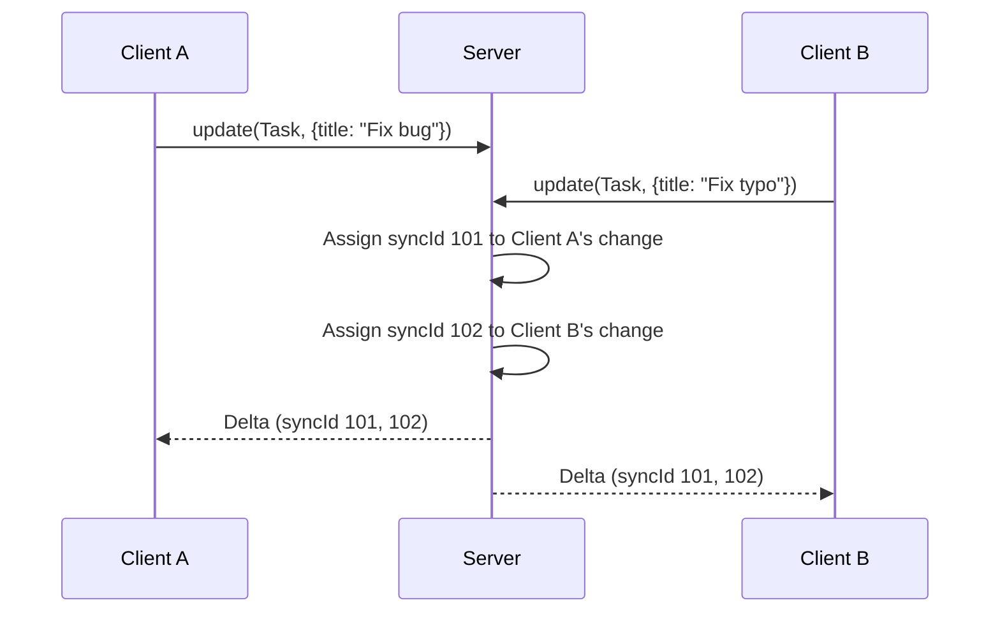
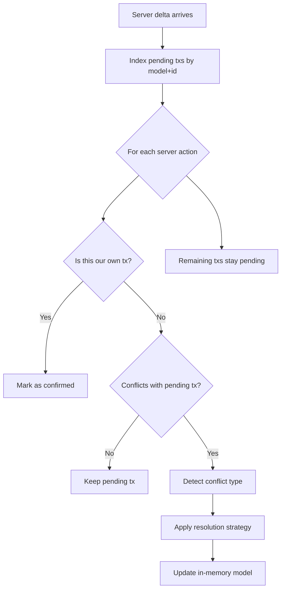

In a local-first system, multiple clients can modify the same data concurrently. Strata Sync uses a server-sequenced model where the server is the ultimate source of truth, combined with a client-side rebase algorithm that automatically resolves most conflicts. This guide explains how it works and when you need to intervene.

## The server-sequenced model

Every committed change receives a monotonically increasing `syncId` from the server. This establishes a total order:



Key properties:

- **Server assigns order**: The server decides which change "wins" when two clients modify the same record.
- **Clients track position**: Each client stores a `lastSyncId` and applies deltas in order, never skipping.
- **Optimistic writes are speculative**: The client applies local changes immediately but doesn't confirm them until the server delta arrives.

## How rebase works

When a server delta arrives for a model that has pending local transactions, the client must rebase -- replay local changes on top of the new server state.



The rebase algorithm processes each server action:

1. **Own transaction**: If the server action's `clientTxId` matches a pending transaction, that transaction is confirmed and removed from the outbox.
2. **No conflict**: If the server action affects a different model/ID, or different fields (with field-level detection enabled), the pending transaction is untouched.
3. **Conflict**: If the server action conflicts with a pending transaction, the conflict type is detected and a resolution strategy is applied.

### Rebase in detail

Each pending Update transaction stores `{ modelId, payload, original }`, where `original[field]` is the value the user saw when they started editing:

```
Client original state:  { title: "Draft",  status: "open"   }
Client pending update:  { title: "Final" }                     <- user changed title
Server delta arrives:   { title: "Draft",  status: "closed" }  <- another user changed status
```

With field-level conflict detection enabled (the default):

- `title`: The client has a pending change, but the server didn't change `title` -- no conflict. The pending update stays.
- `status`: The server changed `status`, but the client has no pending change to `status` -- no conflict. The client applies the server value.

Result: `{ title: "Final", status: "closed" }` -- both changes are preserved.

## Conflict types

The rebase algorithm detects four types of conflicts:

| Type            | Local action | Server action | Example                          |
| --------------- | ------------ | ------------- | -------------------------------- |
| `update-update` | Update       | Update        | Both changed the same field      |
| `update-delete` | Update       | Delete        | Client edited, server deleted    |
| `delete-update` | Delete       | Update        | Client deleted, server edited    |
| `insert-insert` | Insert       | Insert        | Both inserted the same ID (rare) |

Archive (`A`) and Unarchive (`V`) actions are normalized to Update (`U`) for conflict detection purposes, since they're semantically update-like operations.

## Resolution strategies

Each conflict is resolved using one of three strategies:

### server-wins (default)

The client accepts the server's version and discards the local pending transaction.

```ts
const client = createSyncClient({
  // ...adapters
  rebaseStrategy: "server-wins",
});
```

This is the default for all conflict types except `insert-insert`. It is the simplest and most predictable strategy -- the last write to reach the server wins.

**When to use**: Most applications. Works well for form fields, status changes, and assignments where "latest wins" is acceptable.

### client-wins

The client re-applies its change on top of the server state. The client keeps the pending transaction and retransmits it.

```ts
const client = createSyncClient({
  // ...adapters
  rebaseStrategy: "client-wins",
});
```

**When to use**: Rare. Useful when the local user's intent should always take priority, such as a "force update" action.

### merge

The client combines both server and client changes at the field level. The client merges non-overlapping fields; overlapping fields use the client's value.

```ts
const client = createSyncClient({
  // ...adapters
  rebaseStrategy: "merge",
  fieldLevelConflicts: true,
});
```

**When to use**: When different users typically edit different fields of the same record (for example, one user changes the title while another changes the assignee).

## Handling conflicts manually

For cases where automatic resolution is insufficient -- such as critical data where you need user intervention -- use the `rebaseConflict` event to detect conflicts and handle them in your application code.

`insert-insert` conflicts always resolve to `manual` internally regardless of the configured default, since they typically indicate a bug (two clients generating the same ID). These conflicts are surfaced through the `rebaseConflict` event.

## Field-level conflict detection

By default, `fieldLevelConflicts` is enabled (`true`). This means that only changes to the _same fields_ on the same model+ID trigger a conflict. If you want to disable field-level detection so that any concurrent edit to the same model+ID is treated as a conflict, set it to `false`:

```ts
const client = createSyncClient({
  // ...adapters
  rebaseStrategy: "merge",
  fieldLevelConflicts: false, // any overlapping model+ID is a conflict
});
```

With field-level detection (the default):

- **Overlapping fields**: Both client and server changed the same field -- this is a true conflict.
- **Non-overlapping fields**: Client and server changed different fields -- no conflict, the changes can coexist.

This dramatically reduces the number of conflicts in practice, since most concurrent edits affect different fields.

## Handling the rebaseConflict event

When conflicts occur, the client emits a `rebaseConflict` event. Subscribe to it for logging, UI notifications, or custom resolution logic.

```ts
import { createSyncClient } from "@stratasync/client";

const client = createSyncClient({
  // ...adapters
});

client.onEvent((event) => {
  if (event.type !== "rebaseConflict") {
    return;
  }

  // Each conflict fires a separate event with a flat structure:
  // event.modelName, event.modelId, event.conflictType, event.resolution

  switch (event.conflictType) {
    case "update-update": {
      // Two users edited the same field on the same model
      // event.resolution -- "server-wins" | "client-wins" | "merge"
      break;
    }

    case "update-delete": {
      // Local user edited a record that the server deleted
      // You may want to show a "this item was deleted" message
      break;
    }

    case "delete-update": {
      // Local user deleted a record that the server updated
      break;
    }

    case "insert-insert": {
      // Both clients created a record with the same ID
      // This typically indicates a bug in ID generation
      break;
    }
  }
});
```

### Surfacing conflicts in the UI

For manual conflict resolution, you can build UI that listens for the `rebaseConflict` event and lets the user choose:

```tsx
"use client";

import { useState, useEffect } from "react";
import { useSyncClient } from "@stratasync/react";

interface ConflictRecord {
  modelName: string;
  modelId: string;
  conflictType: string;
  resolution: string;
}

export function ConflictResolver() {
  const { client } = useSyncClient();
  const [conflicts, setConflicts] = useState<ConflictRecord[]>([]);

  useEffect(() => {
    // Each rebaseConflict event is a flat object -- one event per conflict
    const unsubscribe = client.onEvent((event) => {
      if (event.type !== "rebaseConflict") {
        return;
      }

      // Accumulate individual conflict events into state
      setConflicts((prev) => [
        ...prev,
        {
          modelName: event.modelName,
          modelId: event.modelId,
          conflictType: event.conflictType,
          resolution: event.resolution,
        },
      ]);
    });

    return unsubscribe;
  }, [client]);

  if (conflicts.length === 0) {
    return null;
  }

  function dismiss(conflict: ConflictRecord) {
    // Accept server version -- discard from the list
    setConflicts((prev) => prev.filter((c) => c !== conflict));
  }

  async function retryWithClient(conflict: ConflictRecord) {
    // Re-apply the local change by updating the model again
    // In practice, you would store the original payload and re-send it
    await client.update(conflict.modelName, conflict.modelId, {});
    setConflicts((prev) => prev.filter((c) => c !== conflict));
  }

  return (
    <div className="fixed bottom-4 right-4 bg-white border rounded-lg shadow-lg p-4 max-w-md">
      <h3 className="font-bold mb-2">
        {conflicts.length} conflict{conflicts.length > 1 ? "s" : ""} detected
      </h3>
      {conflicts.map((conflict, i) => (
        <div key={i} className="border-t pt-2 mt-2">
          <p className="text-sm">
            {conflict.conflictType} on {conflict.modelName}:{conflict.modelId}
          </p>
          <div className="flex gap-2 mt-1">
            <button
              onClick={() => dismiss(conflict)}
              className="text-xs px-2 py-1 bg-gray-100 rounded"
            >
              Keep server version
            </button>
            <button
              onClick={() => retryWithClient(conflict)}
              className="text-xs px-2 py-1 bg-blue-100 rounded"
            >
              Keep my changes
            </button>
          </div>
        </div>
      ))}
    </div>
  );
}
```

## Practical example: handling concurrent edits

Consider two users editing the same task simultaneously:

```
Timeline:
  t0: Both users see Task { title: "Draft", status: "open", priority: "low" }
  t1: User A changes title to "Final Report"
  t2: User B changes status to "in-review"
  t3: User A's change reaches server -> syncId 101
  t4: User B's change reaches server -> syncId 102
```

### With field-level conflicts + merge (recommended)

```ts
const client = createSyncClient({
  // ...adapters
  rebaseStrategy: "merge",
  fieldLevelConflicts: true,
});
```

- User A receives delta 102 (status changed). Their pending title change is on a different field -- no conflict. Result: `{ title: "Final Report", status: "in-review" }`.
- User B receives delta 101 (title changed). Their pending status change is on a different field -- no conflict. Result: `{ title: "Final Report", status: "in-review" }`.
- Both users converge on the same state. No conflicts fired.

### Without field-level conflicts (server-wins default)

```ts
const client = createSyncClient({
  // ...adapters
  fieldLevelConflicts: false,
  // fieldLevelConflicts defaults to true, so you must explicitly disable it
});
```

- User A receives delta 102: the client detects an `update-update` conflict (same model+ID). Server wins -- the client discards User A's pending title change.
- User B receives delta 101: the client detects an `update-update` conflict. Server wins -- the client discards User B's pending status change.
- Both users see the latest server state, but one user's change is lost.

This illustrates why `fieldLevelConflicts: true` (the default) with `rebaseStrategy: "merge"` is the recommended configuration for most applications.

## Choosing a strategy

| Scenario                          | Recommended strategy                                                              |
| --------------------------------- | --------------------------------------------------------------------------------- |
| General purpose (forms, settings) | `rebaseStrategy: "merge"` + `fieldLevelConflicts: true` (default)                 |
| Simple apps, few concurrent users | `rebaseStrategy: "server-wins"` (default)                                         |
| Collaborative text editing        | Use [Yjs CRDTs](/docs/guides/collaborative-editing) instead                       |
| Critical data (finance, legal)    | `rebaseStrategy: "server-wins"` with `rebaseConflict` event handler for custom UI |
| Force-update operations           | `rebaseStrategy: "client-wins"`                                                   |

## Next steps

- [Offline-First Patterns](/docs/guides/offline-first) -- How mutations flow through the outbox.
- [Collaborative Editing](/docs/guides/collaborative-editing) -- CRDT-based editing that avoids field-level conflicts entirely.
- [sync-core Transactions API](/docs/packages/sync-core/transactions) -- Low-level transaction creation and management.
