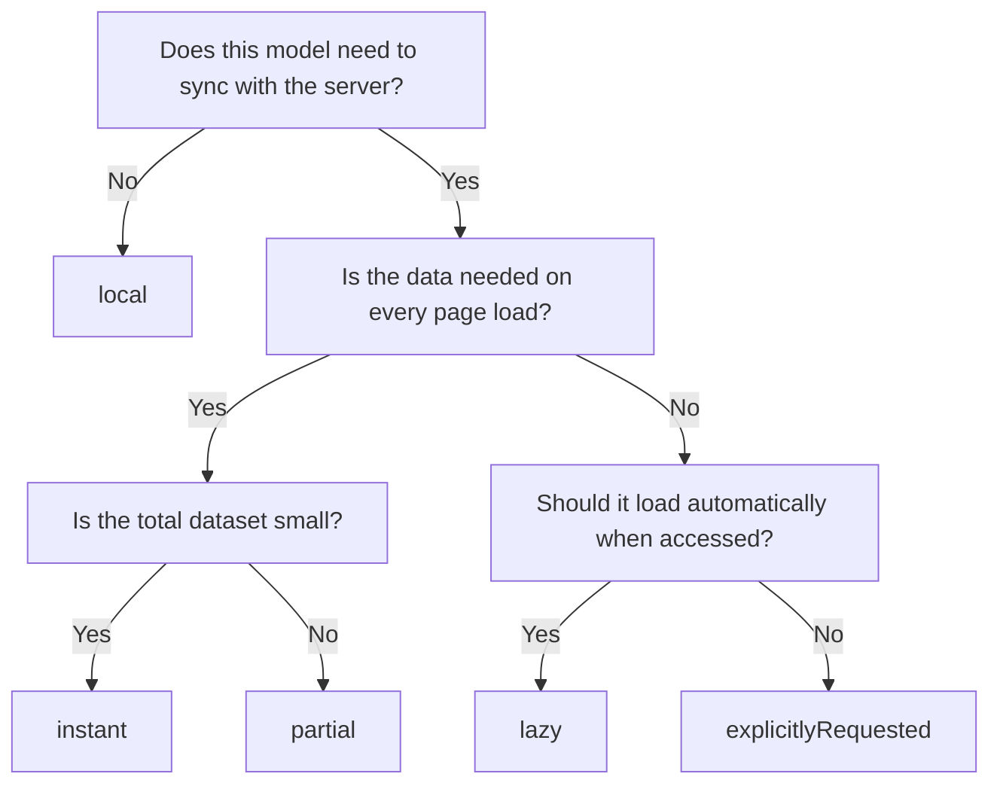
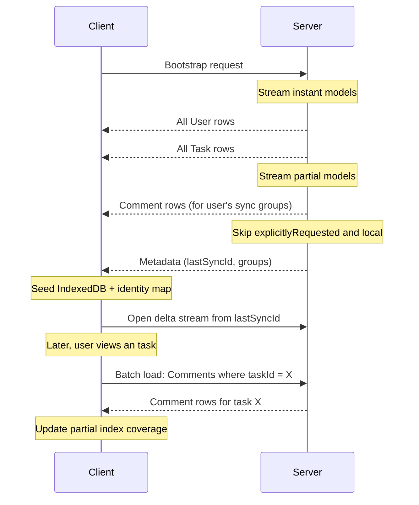

Load strategies determine when and how model data is fetched from the server. Choosing the right strategy for each model is one of the most impactful decisions for application performance. This guide explains each strategy, when to use it, and how they interact with bootstrapping and lazy loading.

## What load strategies control

The load strategy is set per model via the `@ClientModel` decorator:

```ts
@ClientModel("Task", { loadStrategy: "instant" })
export class Task extends Model {
  // ...
}
```

It controls:

- **When** the model's data is fetched from the server (at bootstrap, on access, or on explicit request).
- **How much** data is transferred (all instances, a subset, or nothing until requested).
- **Whether** the data is available offline after the initial load.

## Strategy reference

### instant

```ts
@ClientModel("User", { loadStrategy: "instant" })
```

**Behavior**: The bootstrap snapshot includes all instances of this model. The data is available immediately when the app starts -- no additional network requests needed.

**Best for**: Core models that are always needed and small enough to download in full. Examples: users, teams, projects, labels, statuses.

**Trade-offs**:

- Fast: Data is available from the first render.
- Offline: All data is available offline after bootstrap.
- Size: Adds to the bootstrap payload. For large datasets, this increases initial load time.

### lazy

```ts
@ClientModel("Attachment", { loadStrategy: "lazy" })
```

**Behavior**: The bootstrap doesn't include the data. When a component first accesses this model (via `useModel`, `useQuery`, or a relationship traversal), the client fetches the needed instances from the server.

**Best for**: Models that aren't needed on every page load but should be fetched automatically when accessed. Examples: attachments, audit logs, activity feeds.

**Trade-offs**:

- Lighter bootstrap: Reduces initial payload size.
- On-demand: Users only download what they need.
- Latency: First access requires a network request (show a loading state).
- Offline: Only previously-accessed instances are available offline.

### partial

```ts
@ClientModel("Comment", {
  loadStrategy: "partial",
  partialLoadMode: "regular",
})
```

**Behavior**: The client loads a subset of instances during bootstrap (typically based on sync groups or recent activity). The client fetches additional instances on demand when accessed. The client tracks which subsets have been fetched using a partial index.

**Best for**: Models with many instances where only a relevant subset is needed at any time. Examples: comments (load for recently viewed tasks), notifications (load recent), messages (load for active conversations).

**Partial load modes**:

| Mode          | Behavior                                                     |
| ------------- | ------------------------------------------------------------ |
| `full`        | Load the complete subset during bootstrap (highest priority) |
| `regular`     | Load the subset during bootstrap at normal priority          |
| `lowPriority` | Load the subset after higher-priority models                 |

**Trade-offs**:

- Balanced: Most relevant data is available immediately; the rest loads on demand.
- Complex: Requires partial index tracking in IndexedDB.
- Offline: Only the bootstrapped and previously-accessed subsets are available offline.

### explicitlyRequested

```ts
@ClientModel("AuditLog", { loadStrategy: "explicitlyRequested" })
```

**Behavior**: Never auto-loaded. The client only fetches data when your code explicitly requests it via `client.get()`, `client.query()`, or a batch load call. The delta stream still delivers updates for instances that have been loaded.

**Best for**: Large or sensitive models that should only be loaded when the user navigates to a specific page. Examples: audit logs, analytics data, admin-only models.

**Trade-offs**:

- Minimal bandwidth: No data fetched unless explicitly requested.
- Full control: You decide exactly when data is loaded.
- No auto-sync: Instances aren't present until explicitly fetched.

### local

```ts
@ClientModel("DraftMessage", { loadStrategy: "local" })
```

**Behavior**: Never synced with the server. The client stores data only in the local IndexedDB and the in-memory identity map. Useful for client-only state that should persist across page reloads but never leave the device.

**Best for**: Drafts, user preferences, UI state, unsent messages, local caches.

**Trade-offs**:

- Private: Data never leaves the device.
- Persistent: Survives page reloads (stored in IndexedDB).
- No sync: No server backup, no cross-device access.

## Choosing the right strategy

Use this decision tree to pick a strategy:



### Quick reference table

| Model type         | Example             | Strategy               | Reasoning                    |
| ------------------ | ------------------- | ---------------------- | ---------------------------- |
| Core entities      | User, Team, Project | `instant`              | Always needed, small dataset |
| Primary work items | Task, Task          | `instant` or `partial` | Depends on volume            |
| Secondary content  | Comment, Attachment | `partial` or `lazy`    | Only needed in context       |
| Large datasets     | AuditLog, Analytics | `explicitlyRequested`  | Loaded on specific pages     |
| Sensitive data     | AdminSettings       | `explicitlyRequested`  | Access-controlled            |
| Client-only state  | Draft, UIPreference | `local`                | Never synced                 |

## Performance implications

### Bootstrap payload size

The bootstrap payload includes all `instant` models and the relevant subset of `partial` models. You monitor the payload size:

```ts
const snapshot = await prefetchBootstrap({
  endpoint: process.env.SYNC_API_URL!,
  authorization: `Bearer ${token}`,
});

// Check the row count and estimated size
const rowCount = snapshot.rows.length;
```

If the bootstrap is slow, consider:

1. Moving large models from `instant` to `partial` or `lazy`.
2. Using the `models` option in `prefetchBootstrap` to limit which models are included.
3. Enabling compression in `serializeBootstrapSnapshot`.

### Identity map memory usage

Every loaded model instance lives in the identity map (in memory). For `instant` models, this means all instances are in memory at all times. For applications with thousands of records, this can consume significant memory.

Strategies to manage memory:

- Use `partial` instead of `instant` for models with many instances.
- Use `explicitlyRequested` for rarely-accessed models.
- Set `usedForPartialIndexes` on models that are only needed as foreign key targets.

### Delta stream filtering

The delta stream delivers updates for all models the client has access to, regardless of load strategy. However, the client only applies deltas for models that are already in the identity map. This means:

- `instant` models receive and apply all deltas immediately.
- `lazy` and `partial` models only apply deltas for instances that have been loaded.
- `explicitlyRequested` models only apply deltas for explicitly-fetched instances.
- `local` models never receive deltas.

## Example: large dataset with partial loading

Consider an application with tasks, comments, and audit logs:

```ts
// Always loaded -- small dataset
@ClientModel("User", { loadStrategy: "instant" })
export class User extends Model {
  @Property()
  declare id: string;

  @Property()
  declare name: string;

  @Property()
  declare email: string;
}

// Always loaded -- core work items
@ClientModel("Task", { loadStrategy: "instant" })
export class Task extends Model {
  @Property()
  declare id: string;

  @Property()
  declare title: string;

  @Property()
  declare status: string;

  @Property()
  declare projectId: string;
}

// Partially loaded -- fetch comments for viewed tasks
@ClientModel("Comment", {
  loadStrategy: "partial",
  partialLoadMode: "regular",
  usedForPartialIndexes: true,
})
export class Comment extends Model {
  @Property()
  declare id: string;

  @Property()
  declare body: string;

  @Property()
  declare taskId: string;

  @Property()
  declare authorId: string;

  @Property()
  declare createdAt: string;
}

// Only loaded when explicitly requested
@ClientModel("AuditLog", { loadStrategy: "explicitlyRequested" })
export class AuditLog extends Model {
  @Property()
  declare id: string;

  @Property()
  declare action: string;

  @Property()
  declare modelName: string;

  @Property()
  declare modelId: string;

  @Property()
  declare userId: string;

  @Property()
  declare createdAt: string;
}

// Local-only draft state
@ClientModel("CommentDraft", { loadStrategy: "local" })
export class CommentDraft extends Model {
  @Property()
  declare id: string;

  @Property()
  declare taskId: string;

  @Property()
  declare body: string;

  @Property()
  declare updatedAt: string;
}
```

### Bootstrap flow for this configuration



The `CommentDraft` model never appears in bootstrap or delta traffic -- it exists only in IndexedDB on the user's device. The client only loads the `AuditLog` model when the user navigates to the audit log page.

## Next steps

- [Model Relationships](/docs/guides/model-relationships) -- How load strategies interact with relationship decorators.
- [SSR Bootstrap](/docs/guides/ssr-bootstrap) -- Prefetch bootstrap data on the server for instant first paint.
- [sync-core Models API](/docs/packages/sync-core/models) -- Full API reference for model decorators and options.
