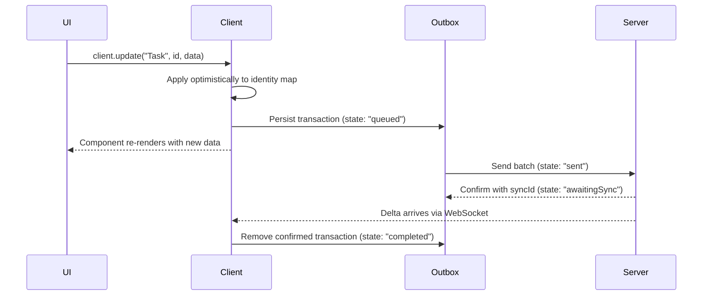
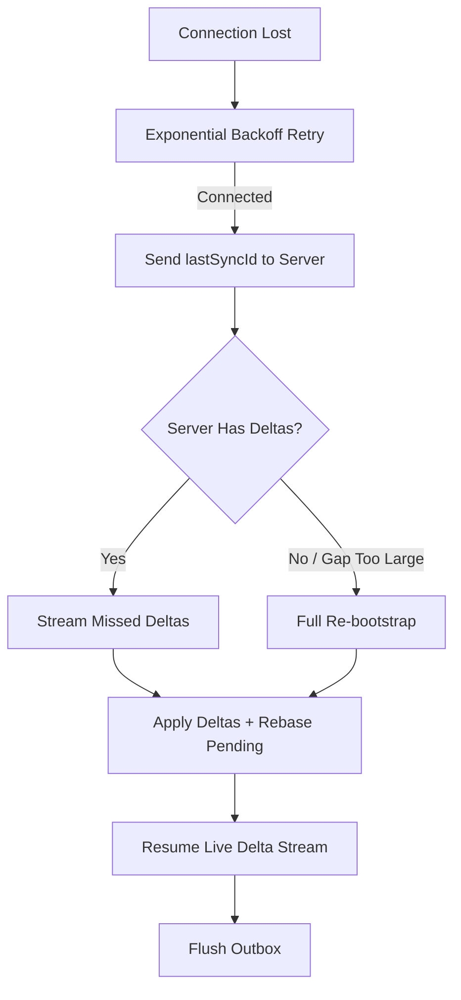

Strata Sync is designed from the ground up for offline-first applications. Every mutation is applied locally before it reaches the server, persisted in an outbox that survives page reloads, and automatically retried when connectivity returns. This guide explains how each piece works and how to build a polished offline UX.

## How the outbox works

Every mutation (create, update, delete, archive) follows the same path:



Each transaction in the outbox has a lifecycle:

| State          | Meaning                                           |
| -------------- | ------------------------------------------------- |
| `queued`       | Persisted locally, waiting to be sent             |
| `sent`         | Transmitted to the server, awaiting response      |
| `awaitingSync` | Server accepted, waiting for the confirming delta |
| `completed`    | Delta received, transaction fully confirmed       |
| `failed`       | Server rejected the mutation                      |

The storage adapter stores the outbox in IndexedDB, so pending mutations survive page reloads, browser crashes, and device restarts. When the client starts up, it replays any `queued` or `sent` transactions.

## Optimistic updates

When you call a mutation method, the client applies the change to the in-memory identity map immediately -- before any network request. This means the UI reflects the user's intent without waiting for the server.

```tsx
"use client";

import { observer } from "mobx-react-lite";
import { useSyncClient } from "@stratasync/react";

const TaskStatus = observer(function TaskStatus({
  taskId,
}: {
  taskId: string;
}) {
  const { client } = useSyncClient();

  async function markDone() {
    // This updates the UI instantly, then syncs in the background
    await client.update("Task", taskId, {
      status: "done",
      updatedAt: new Date().toISOString(),
    });
  }

  return <button onClick={markDone}>Mark as Done</button>;
});
```

Because Strata Sync uses MobX for reactivity, any component observing the task's `status` field re-renders the moment the client applies the optimistic update -- not when the server responds.

If the server rejects the mutation, the client rolls back the optimistic update and emits a `rebaseConflict` event. See the [Conflict Resolution](/docs/guides/conflict-resolution) guide for details.

## Monitoring connection state

Use `useConnectionState` and `useIsOffline` to track the sync connection and show appropriate UI.

```tsx
"use client";

import {
  useConnectionState,
  useIsOffline,
  usePendingCount,
} from "@stratasync/react";

export function SyncIndicator() {
  const { status, error } = useConnectionState();
  const isOffline = useIsOffline();
  const { count, hasPending } = usePendingCount();

  if (error) {
    return (
      <div className="bg-red-100 text-red-800 px-3 py-1 rounded">
        Sync error: {error.message}
      </div>
    );
  }

  if (isOffline) {
    return (
      <div className="bg-yellow-100 text-yellow-800 px-3 py-1 rounded">
        Offline
        {hasPending && <span> -- {count} pending changes</span>}
      </div>
    );
  }

  return (
    <div className="bg-green-100 text-green-800 px-3 py-1 rounded">
      Connected ({status})
      {hasPending && <span> -- syncing {count} changes</span>}
    </div>
  );
}
```

### Connection state values

The `status` field from `useConnectionState()` is one of:

| Status          | Meaning                               |
| --------------- | ------------------------------------- |
| `disconnected`  | No active connection to the server    |
| `connecting`    | Establishing WebSocket connection     |
| `bootstrapping` | Downloading initial data snapshot     |
| `syncing`       | Connected and streaming deltas        |
| `error`         | Connection failed (see `error` field) |

## Pending mutation tracking

`usePendingCount` gives you real-time visibility into unsynced mutations:

```tsx
"use client";

import { usePendingCount } from "@stratasync/react";

export function SaveIndicator() {
  const { count, hasPending } = usePendingCount();

  if (!hasPending) {
    return <span className="text-gray-400">All changes saved</span>;
  }

  return (
    <span className="text-blue-600">
      Saving {count} {count === 1 ? "change" : "changes"}...
    </span>
  );
}
```

This is useful for:

- Showing a "saving..." indicator in the toolbar
- Warning the user before closing the tab with unsaved changes
- Disabling navigation while mutations are in flight

### Preventing data loss on tab close

Combine `usePendingCount` with the `beforeunload` event to warn users:

```tsx
"use client";

import { useEffect } from "react";
import { usePendingCount } from "@stratasync/react";

export function PendingGuard() {
  const { hasPending } = usePendingCount();

  useEffect(() => {
    if (!hasPending) {
      return;
    }

    function handleBeforeUnload(event: BeforeUnloadEvent) {
      event.preventDefault();
    }

    window.addEventListener("beforeunload", handleBeforeUnload);
    return () => {
      window.removeEventListener("beforeunload", handleBeforeUnload);
    };
  }, [hasPending]);

  return null;
}
```

## Reconnection flow

When the connection drops, Strata Sync handles recovery automatically:



Key behaviors:

- **Exponential backoff**: Retries at 1s, 2s, 4s... up to 30s, with 20% jitter to avoid thundering herd.
- **Delta catch-up**: The client sends its `lastSyncId` and receives only the deltas it missed. No full re-download needed in most cases.
- **Outbox replay**: Once connected, the client retransmits any queued or previously-sent mutations. Each mutation carries an idempotency key, so duplicate delivery is safe.
- **Rebase**: If server deltas arrived during the offline period that affect the same models as pending mutations, the client rebases automatically (see [Conflict Resolution](/docs/guides/conflict-resolution)).

## Best practices for offline-first UX

### 1. Always show sync status

Place a `SyncIndicator` component in your app shell so users know when they're offline and how many changes are pending.

### 2. Design for optimistic writes

Assume every mutation succeeds. Show the result immediately and handle failures as exceptions rather than expected outcomes. This makes the app feel instant.

### 3. Use idempotent mutations

Every transaction includes a unique `clientTxId` and idempotency key. If a mutation is sent twice (for example, after a reconnection), the server deduplicates it. Structure your mutations so that replaying them produces the same result.

### 4. Handle conflicts gracefully

Register a listener for `rebaseConflict` events to handle the rare case where an optimistic update conflicts with a server change:

```ts
client.onEvent((event) => {
  if (event.type === "rebaseConflict") {
    // Each conflict fires a separate event
    // event.modelName, event.modelId, event.conflictType, event.resolution
    if (event.resolution === "server-wins") {
      // The client applied the server's version -- the UI already reflects it
    }
  }
});
```

### 5. Warn before closing with pending changes

Use the `PendingGuard` component shown above, or a custom solution, to prevent accidental data loss when the user closes the tab with unsynced mutations.

## Complete example: offline-capable task manager

This example ties together all the patterns into a single component:

```tsx
"use client";

import { observer } from "mobx-react-lite";
import { Suspense } from "react";
import {
  useQuery,
  useSyncClient,
  useConnectionState,
  useIsOffline,
  usePendingCount,
} from "@stratasync/react";

function OfflineBanner() {
  const isOffline = useIsOffline();
  const { count, hasPending } = usePendingCount();

  if (!isOffline) {
    return null;
  }

  return (
    <div className="bg-yellow-50 border-b border-yellow-200 px-4 py-2 text-sm">
      You are offline.
      {hasPending && (
        <span>
          {" "}
          {count} {count === 1 ? "change" : "changes"} will sync when you
          reconnect.
        </span>
      )}
    </div>
  );
}

const TaskList = observer(function TaskList() {
  const { client } = useSyncClient();
  const { data: tasks, isLoading } = useQuery("Task", {
    where: (task) => (task as Record<string, string>).status !== "archived",
    orderBy: (a, b) =>
      (b as Record<string, string>).createdAt.localeCompare(
        (a as Record<string, string>).createdAt
      ),
  });

  if (isLoading) {
    return <p className="text-gray-500">Loading tasks...</p>;
  }

  async function addTask() {
    await client.create("Task", {
      title: "New task",
      status: "todo",
      createdAt: new Date().toISOString(),
      updatedAt: new Date().toISOString(),
    });
  }

  async function toggleDone(taskId: string, currentStatus: string) {
    await client.update("Task", taskId, {
      status: currentStatus === "done" ? "todo" : "done",
      updatedAt: new Date().toISOString(),
    });
  }

  return (
    <div>
      <button
        onClick={addTask}
        className="mb-4 px-4 py-2 bg-blue-600 text-white rounded"
      >
        Add Task
      </button>

      <ul className="space-y-2">
        {tasks.map((task) => {
          const t = task as Record<string, string>;
          return (
            <li
              key={t.id}
              className="flex items-center gap-2 p-2 border rounded"
            >
              <input
                type="checkbox"
                checked={t.status === "done"}
                onChange={() => toggleDone(t.id, t.status)}
              />
              <span
                className={
                  t.status === "done" ? "line-through text-gray-400" : ""
                }
              >
                {t.title}
              </span>
            </li>
          );
        })}
      </ul>
    </div>
  );
});

export default function TaskManager() {
  return (
    <div>
      <OfflineBanner />
      <div className="p-4">
        <h1 className="text-xl font-bold mb-4">Tasks</h1>
        <Suspense fallback={<p>Loading...</p>}>
          <TaskList />
        </Suspense>
      </div>
    </div>
  );
}
```

This component works identically whether the user is online or offline. The client applies mutations instantly, the outbox persists them, and the client syncs them when connectivity is available.

## Next steps

- [Conflict Resolution](/docs/guides/conflict-resolution) -- How the rebase algorithm handles concurrent edits.
- [Collaborative Editing](/docs/guides/collaborative-editing) -- Add real-time multi-user editing with Yjs.
- [SSR Bootstrap](/docs/guides/ssr-bootstrap) -- Pre-load data on the server for instant first paint.
