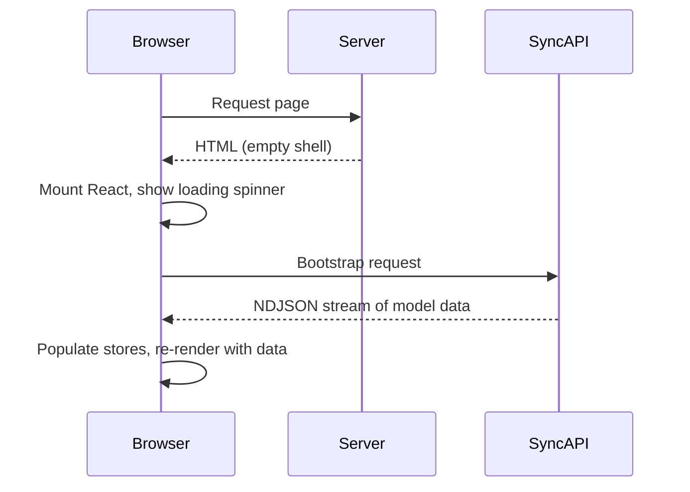
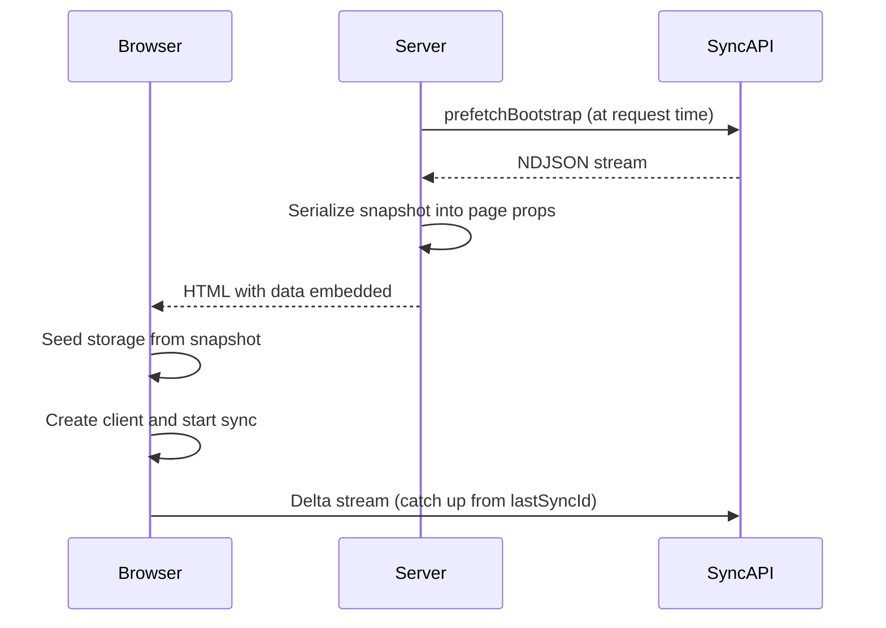
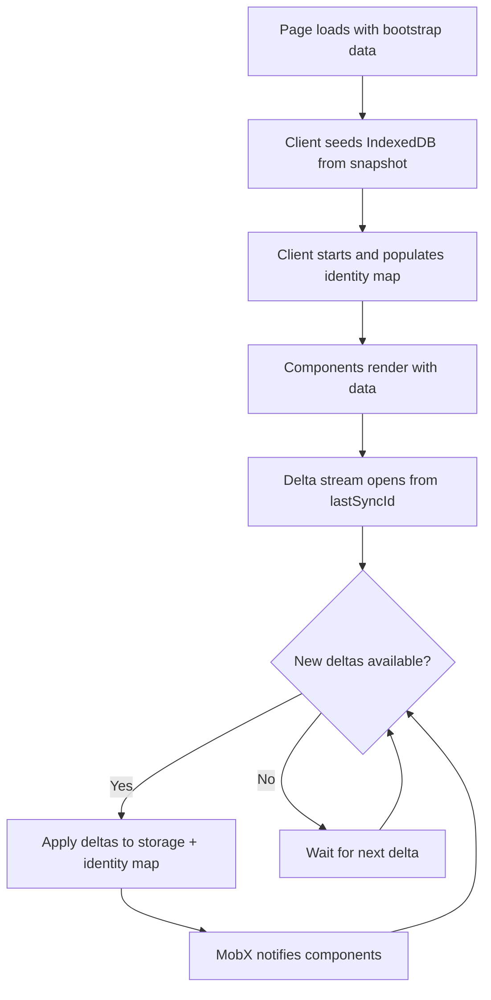

Strata Sync supports server-side rendering (SSR) with Next.js App Router to deliver instant first paint with data. Instead of showing a loading spinner while the client bootstraps from the sync endpoint, you can prefetch the data on the server, serialize it into the HTML response, and seed the client storage on load.

## Why bootstrap matters

Without SSR bootstrap, the user experience looks like this:



With SSR bootstrap:



The user sees the page with data on first paint -- no loading spinner, no layout shift.

## Using prefetchBootstrap on the server

The `prefetchBootstrap` function from `@stratasync/next/server` fetches a full bootstrap snapshot from your sync API endpoint. You run it in a Server Component or `generateMetadata` context.

```ts
import {
  prefetchBootstrap,
  serializeBootstrapSnapshot,
} from "@stratasync/next/server";

const snapshot = await prefetchBootstrap({
  endpoint: "https://api.example.com/sync",
  authorization: `Bearer ${userToken}`,
  models: ["Task", "User", "Team"],
  timeout: 10_000, // 10 seconds (default)
});
```

### Options

| Option          | Type                     | Default       | Description                       |
| --------------- | ------------------------ | ------------- | --------------------------------- |
| `endpoint`      | `string`                 | required      | Base URL of your sync API         |
| `authorization` | `string`                 | --            | Bearer token or other auth header |
| `headers`       | `Record<string, string>` | --            | Additional request headers        |
| `models`        | `string[]`               | all models    | Only fetch these model types      |
| `groups`        | `string[]`               | user's groups | Sync group filter                 |
| `schemaHash`    | `string`                 | computed      | Schema hash for cache validation  |
| `timeout`       | `number`                 | `10_000`      | Request timeout in milliseconds   |

### What the snapshot contains

The returned `BootstrapSnapshot` has this shape:

```ts
interface BootstrapSnapshot {
  version: 1;
  schemaHash: string;
  lastSyncId: number;
  firstSyncId?: number;
  groups: string[];
  rows: ModelRow[]; // Array of { modelName, data }
  fetchedAt: number; // Timestamp for stale checking
  rowCount?: number;
}
```

The `rows` array contains every model instance the user has access to, streamed as NDJSON from the sync API. The `lastSyncId` tells the client where to start its delta stream.

## Serializing and passing to the client

Server Components can't pass complex objects directly to Client Components. You use `serializeBootstrapSnapshot` to encode the snapshot into a transferable payload.

```ts
import {
  prefetchBootstrap,
  serializeBootstrapSnapshot,
} from "@stratasync/next/server";

// In a Server Component or layout
const snapshot = await prefetchBootstrap({
  endpoint: process.env.SYNC_API_URL,
  authorization: `Bearer ${token}`,
});

// Serialize for transfer (supports optional gzip compression)
const payload = await serializeBootstrapSnapshot(snapshot, {
  compress: true, // Uses CompressionStream when available
});
```

The serialized payload has two possible encodings:

| Encoding      | Format                          | When                                          |
| ------------- | ------------------------------- | --------------------------------------------- |
| `json`        | Plain JSON string               | Compression unavailable or disabled           |
| `gzip-base64` | Gzip-compressed, base64-encoded | Default when `CompressionStream` is available |

## NextSyncProvider

The `NextSyncProvider` from `@stratasync/next` wraps your application with the sync context. It accepts a `client` instance (or a factory function that returns one), handles initialization, and provides loading and error states.

```ts
interface NextSyncProviderProps {
  client: SyncClient | (() => SyncClient);
  children: ReactNode;
  loading?: ReactNode;
  error?: (error: Error) => ReactNode;
  onReady?: () => void;
  onError?: (error: Error) => void;
}
```

On mount, `NextSyncProvider`:

1. Resolves the client (calling the factory if a function was provided).
2. Calls `client.start()` to begin syncing.
3. Renders `loading` while the client initializes.
4. Renders `children` wrapped in a `SyncProvider` once the client is ready.

The provider does **not** handle bootstrap seeding automatically. You must call `seedStorageFromBootstrap` yourself before the client starts, so that the client finds pre-populated data in storage when it initializes.

## Seeding storage from bootstrap

The `seedStorageFromBootstrap` function populates IndexedDB with the server-prefetched snapshot. You call it before creating or starting the sync client so that the client reads the seeded data on startup.

```ts
import { seedStorageFromBootstrap } from "@stratasync/next";
import { createIndexedDbStorage } from "@stratasync/storage-idb";

const storage = createIndexedDbStorage({ name: "my-app" });

const result = await seedStorageFromBootstrap({
  storage,
  snapshot: payload, // BootstrapSnapshot | BootstrapSnapshotPayload | string
  dbName: "my-app",
  clearExisting: true, // Wipe existing data before seeding
  validateSchemaHash: true, // Reject if schema mismatch
  batchSize: 500, // Rows per IndexedDB write batch
  closeAfter: true, // Close storage after seeding
});

if (!result.applied) {
  // result.reason === "schema_mismatch"
  // Schema changed -- need a full re-bootstrap
}
```

### Seed result

| Field      | Type                | Description                                              |
| ---------- | ------------------- | -------------------------------------------------------- |
| `applied`  | `boolean`           | Whether the function applied the seed                    |
| `rowCount` | `number`            | Number of rows the function wrote                        |
| `reason`   | `"schema_mismatch"` | Why the function didn't apply it (if `applied` is false) |

## Stale checking with isBootstrapSnapshotStale

If the page was cached or the user navigated with a stale snapshot, you can detect this:

```ts
import { isBootstrapSnapshotStale } from "@stratasync/next/server";

const snapshot = await prefetchBootstrap({ endpoint });

if (isBootstrapSnapshotStale(snapshot, 30_000)) {
  // Snapshot is older than 30 seconds
  // The client will catch up via delta stream, but you could
  // re-fetch if you want completely fresh data
}
```

The default `maxAge` is 30,000 ms (30 seconds). In practice, staleness isn't a problem because the client catches up via the delta stream immediately after hydration.

## Complete Next.js App Router example

Here is a full example showing the server component fetching data, the client component seeding storage, and then starting the sync client.

### Server Component (layout or page)

```tsx
// app/layout.tsx (Server Component)
import {
  prefetchBootstrap,
  serializeBootstrapSnapshot,
} from "@stratasync/next/server";
import { cookies } from "next/headers";
import { Providers } from "./providers";

export default async function RootLayout({
  children,
}: {
  children: React.ReactNode;
}) {
  const cookieStore = await cookies();
  const token = cookieStore.get("session")?.value;

  let bootstrap = null;

  if (token) {
    try {
      const snapshot = await prefetchBootstrap({
        endpoint: process.env.SYNC_API_URL!,
        authorization: `Bearer ${token}`,
        models: ["Task", "User", "Team", "Project"],
        timeout: 5_000,
      });

      bootstrap = await serializeBootstrapSnapshot(snapshot, {
        compress: true,
      });
    } catch {
      // If prefetch fails, the client will bootstrap normally
      // This is a graceful degradation -- SSR bootstrap is an optimization
    }
  }

  return (
    <html lang="en">
      <body>
        <Providers bootstrap={bootstrap}>{children}</Providers>
      </body>
    </html>
  );
}
```

### Client Component (providers)

```tsx
// app/providers.tsx
"use client";

import { useRef, useCallback } from "react";
import { NextSyncProvider, seedStorageFromBootstrap } from "@stratasync/next";
import type { BootstrapSnapshotPayload } from "@stratasync/next/server";
import { createSyncClient } from "@stratasync/client";
import { createIndexedDbStorage } from "@stratasync/storage-idb";
import { createGraphQLTransport } from "@stratasync/transport-graphql";
import { createMobXReactivity } from "@stratasync/mobx";
import { schema } from "../lib/schema";

function createClient() {
  return createSyncClient({
    schema,
    storage: createIndexedDbStorage({ name: "my-app" }),
    transport: createGraphQLTransport({
      endpoint: "/api/graphql",
      syncEndpoint: "/api/sync",
      wsEndpoint: "wss://api.example.com/sync",
      auth: { getAccessToken: async () => "token" },
    }),
    reactivity: createMobXReactivity(),
  });
}

export function Providers({
  children,
  bootstrap,
}: {
  children: React.ReactNode;
  bootstrap: BootstrapSnapshotPayload | null;
}) {
  // Use a factory function to seed storage before creating the client
  const seeded = useRef(false);
  const clientFactory = useCallback(() => {
    const client = createClient();

    // Seed storage synchronously before the provider calls client.start()
    // seedStorageFromBootstrap is async, so we kick it off and let the client
    // handle it -- the storage adapter will have data by the time queries run
    if (bootstrap && !seeded.current) {
      seeded.current = true;
      const storage = createIndexedDbStorage({ name: "my-app" });
      seedStorageFromBootstrap({
        storage,
        snapshot: bootstrap,
        dbName: "my-app",
        clearExisting: true,
        closeAfter: true,
      });
    }

    return client;
  }, [bootstrap]);

  return (
    <NextSyncProvider client={clientFactory} loading={<div>Loading...</div>}>
      {children}
    </NextSyncProvider>
  );
}
```

The key pattern here is:

1. **Server**: Prefetch the bootstrap snapshot and serialize it into the HTML response.
2. **Client**: Before the sync client starts, call `seedStorageFromBootstrap` to populate IndexedDB with the server data.
3. **Client**: Pass the client (or factory) to `NextSyncProvider`, which calls `client.start()` and renders children once ready.

Because the function seeds storage before the client initializes, `useQuery` and `useModel` hooks return data on the very first render -- no loading state, no flash of empty content.

### Page using synced data

```tsx
// app/tasks/page.tsx (Server Component)
import { Suspense } from "react";
import { TaskList } from "./task-list";

export default function TasksPage() {
  return (
    <div className="p-4">
      <h1 className="text-2xl font-bold mb-4">Tasks</h1>
      <Suspense fallback={<p>Loading tasks...</p>}>
        <TaskList />
      </Suspense>
    </div>
  );
}
```

```tsx
// app/tasks/task-list.tsx
"use client";

import { observer } from "mobx-react-lite";
import { useQuery } from "@stratasync/react";

export const TaskList = observer(function TaskList() {
  const { data: tasks, isLoading } = useQuery("Task", {
    orderBy: (a, b) =>
      (b as Record<string, string>).createdAt.localeCompare(
        (a as Record<string, string>).createdAt
      ),
  });

  if (isLoading) {
    return <p>Loading...</p>;
  }

  return (
    <ul className="space-y-2">
      {tasks.map((task) => {
        const i = task as Record<string, string>;
        return (
          <li key={i.id} className="p-3 border rounded">
            <strong>{i.title}</strong>
            <span className="ml-2 text-gray-500">{i.status}</span>
          </li>
        );
      })}
    </ul>
  );
});
```

## Incremental hydration flow

After the initial bootstrap, the client keeps data fresh through incremental hydration:



The transition from server-rendered to live data is seamless. Users see the server-rendered page immediately, and the client applies any changes that happened between the server render and the client hydration as soon as the delta stream catches up.

## Next steps

- [Offline-First Patterns](/docs/guides/offline-first) -- How the client handles connectivity loss after bootstrap.
- [Load Strategies](/docs/guides/load-strategies) -- Control which models are included in the bootstrap.
- [sync-next API Reference](/docs/packages/sync-next) -- Full API documentation for server and client exports.
