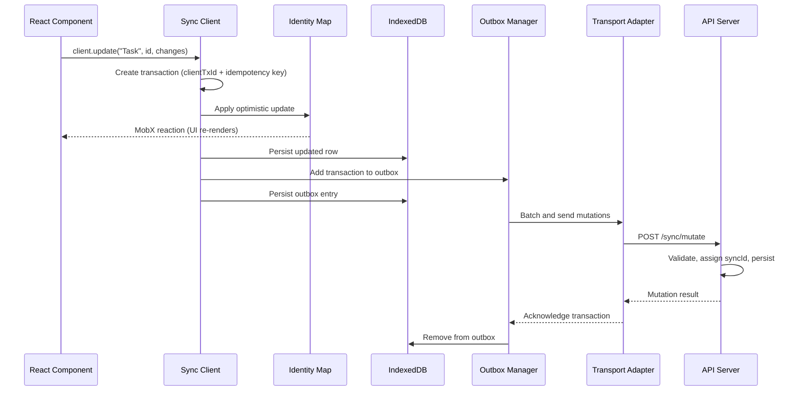
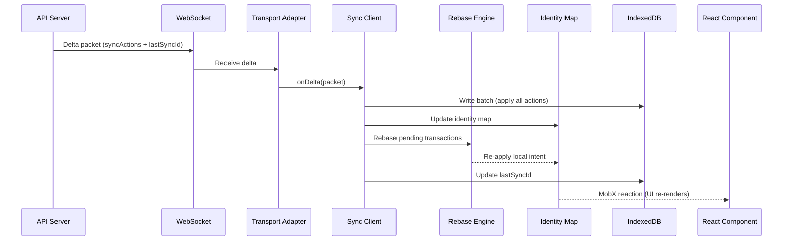
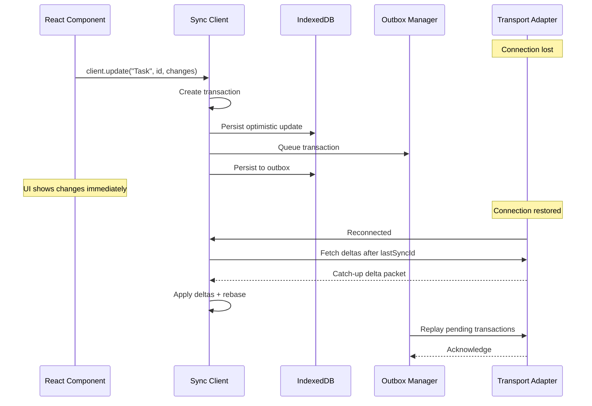
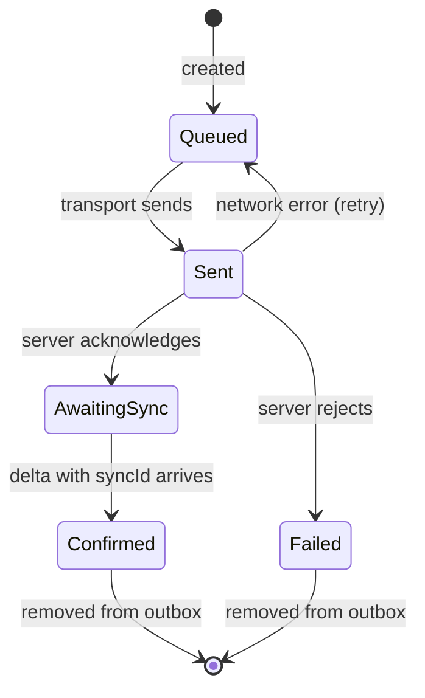

Two primary data flows: **client writes** (mutations going to the server) and **server pushes** (deltas coming back).

## Client write flow

Call a mutation method on the sync client. The change applies optimistically, persists locally, and sends to the server in the background.

### Key steps

1. **Optimistic apply**: Creates a `Transaction` with an idempotency key, applies to the identity map, and persists to IndexedDB.

2. **Batch send**: The outbox batches transactions based on `batchDelay` (default 50 ms), reducing network overhead.

3. **Server processing**: Validates the mutation, assigns a `syncId`, persists, and broadcasts a delta to all clients.

4. **Acknowledgment**: The server responds with the assigned `syncId`. The outbox removes acknowledged transactions.

## Server push flow

Deltas arrive through the WebSocket subscription when another client writes a change or the server processes your own mutation.

### Key steps

1. **Batch write**: Applies all sync actions from the `DeltaPacket` to IndexedDB in a single atomic write.

2. **Identity map update**: Inserts create instances, updates modify them, deletes remove them.

3. **Rebase**: If affected models have pending local transactions, the rebase engine reconciles server state with local intent.

4. **Watermark advance**: Advances `lastSyncId` to the packet's watermark, so the next delta fetch starts from the right place.

## Conflict resolution (rebase)

Field-level LWW rebase resolves conflicts between server deltas and pending local transactions. Each pending transaction stores a `patch` and an `original` snapshot. Non-overlapping changes merge cleanly; overlapping fields use the configured `rebaseStrategy` (`"server-wins"`, `"client-wins"`, or `"merge"`).

See [Conflict resolution](../guides/conflict-resolution) for strategies and examples.

## Offline and reconnect flow

Read and write while disconnected: the outbox queues mutations in IndexedDB until the connection returns.

On reconnection, the client fetches missed deltas, then replays the outbox. Idempotency keys make retry safe, even if a mutation was sent but not acknowledged before the disconnect.

See [Offline-first guide](../guides/offline-first) for configuration and best practices.

## Transaction lifecycle

Each outbox transaction moves through these states:

**Queued** (waiting to send), **Sent** (awaiting response), **AwaitingSync** (acknowledged, delta pending), **Confirmed** (done, removed from outbox), **Failed** (rejected, rolled back). Network errors move back to Queued for retry.
