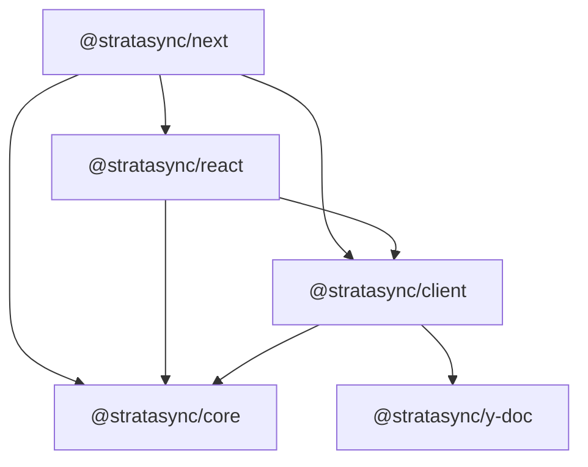
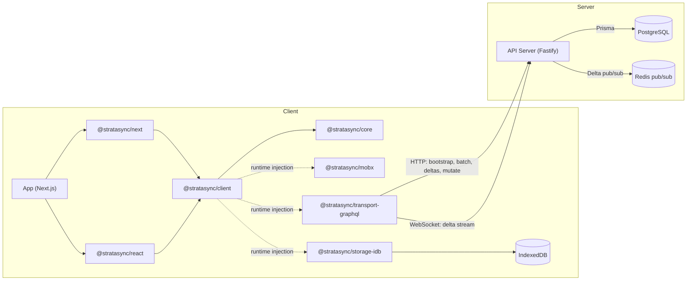

The core is framework-agnostic. Adapters at the edges handle React, MobX, IndexedDB, and GraphQL. The sync protocol is based on [Linear's published design](/architecture/sync-protocol#design-lineage).

## Package dependency graph

Compile-time dependencies between packages:

Dependencies flow downward. `@stratasync/core` has zero runtime dependencies on any framework, storage engine, or transport: you can test sync logic in pure Node.js without a browser.

Storage, transport, and reactivity adapters implement interfaces from `@stratasync/core` and are injected at runtime via `SyncClientOptions`. Swap adapters without changing the dependency graph.

## Layered architecture

Each layer builds on the one below. See the individual [package docs](/packages) for API details.

### Layer 1: Schema and metadata (`@stratasync/core`)

The `ModelRegistry` stores field metadata, relation metadata, load strategies, and a deterministic schema hash for cache-busting and migrations.

### Layer 2: Runtime state (`@stratasync/core`)

An in-memory identity map keyed by model name and primary key, guaranteeing one object per record. A pluggable `ReactivityAdapter` notifies the UI when fields change.

### Layer 3: Local persistence (`@stratasync/storage-idb`)

A durable local replica in IndexedDB storing model rows, sync metadata, the persistent outbox, and partial-index coverage. The `StorageAdapter` interface is transport-agnostic.

### Layer 4: Sync protocol (`@stratasync/client`)

Handles bootstrapping, delta streaming over WebSockets (with HTTP fallback), outbox management with retry and idempotency keys, and field-level LWW rebase on conflicts.

### Layer 5: Transport (`@stratasync/transport-graphql`)

Moves data between client and server using NDJSON streaming for bootstrap, GraphQL mutations with batch support, and WebSocket subscriptions for real-time deltas.

### Layer 6: Reactivity (`@stratasync/mobx`)

Turns model instances into MobX observables. Delta application wraps in a MobX transaction for atomic UI updates.

### Layer 7: Framework integration (`@stratasync/react`, `@stratasync/next`)

React hooks and providers connect the sync client to the component tree. The Next.js package adds server-side bootstrap prefetching for fast first paint. See [React](/packages/react) and [Next.js](/packages/next) for the full hook API.

## Full system architecture

## Design principles

1. **Deterministic core, adapters at the edges**: The delta applier, rebase algorithm, and transaction serializer produce the same output for the same input. Swap storage, transport, or reactivity without touching the core.

2. **Offline is the default**: Every read comes from the local store; every write goes to the outbox. Network is an optimization, not a requirement.

3. **Server is the authority**: The server assigns global ordering. Clients apply mutations optimistically, but confirmed state only advances through server-issued deltas.
