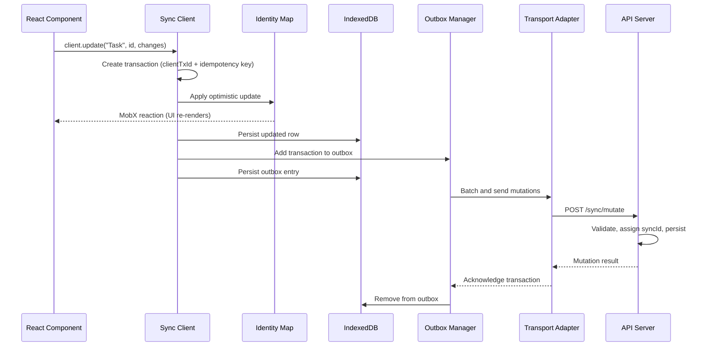
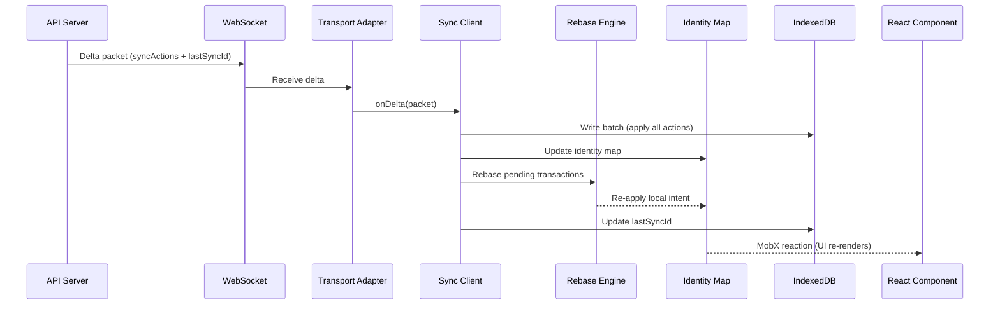
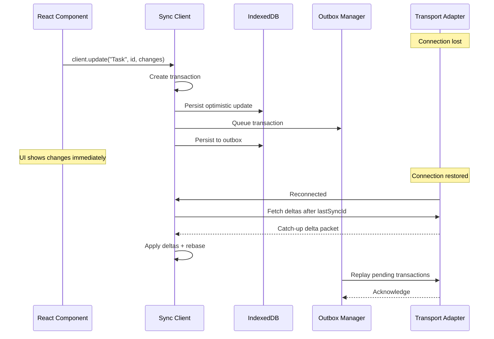
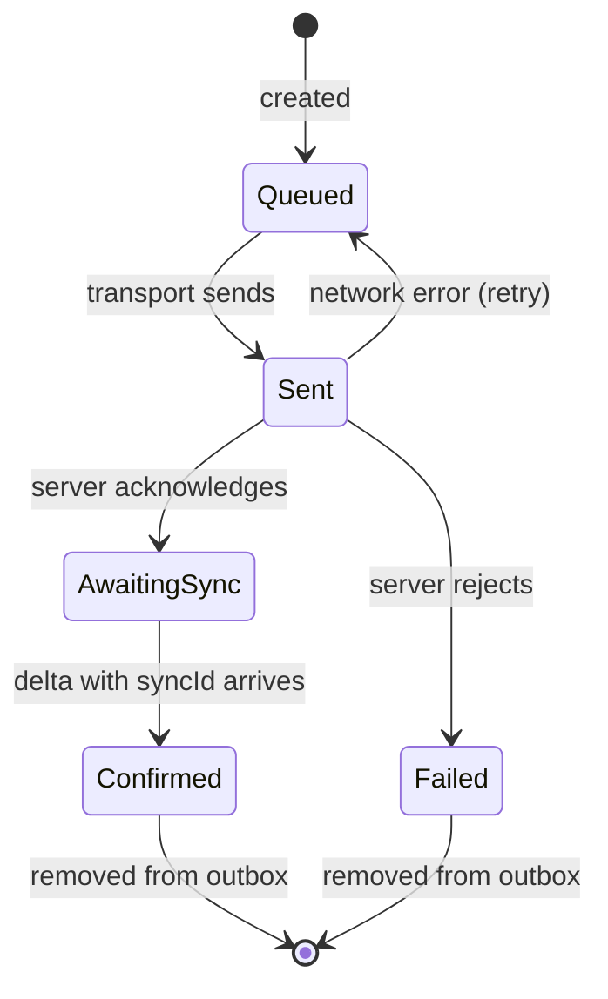

Strata Sync has two primary data flows: **client writes** (mutations going to the server) and **server pushes** (deltas coming back). This page walks through each flow, explains conflict resolution at a high level, and covers offline behavior.

## Client write flow

You trigger a write by calling a mutation method on the sync client. The client applies your change optimistically, persists it locally, and sends it to the server in the background.

### Key steps

1. **Optimistic apply** -- The client creates a `Transaction` with an idempotency key, applies the change to the in-memory identity map, and persists both the updated row and the outbox entry to IndexedDB.

2. **Batch send** -- The outbox manager collects transactions and batches them based on `batchDelay` (default 50 ms), reducing network overhead for rapid edits.

3. **Server processing** -- The server validates the mutation, assigns a `syncId`, persists the change, and broadcasts a delta to all connected clients.

4. **Acknowledgment** -- The server responds with the assigned `syncId`. The outbox manager removes acknowledged transactions from persistent storage.

## Server push flow

When another client writes a change -- or the server processes your own mutation -- the delta arrives through the WebSocket (WS) subscription.

### Key steps

1. **Batch write** -- The client applies all sync actions from the `DeltaPacket` to IndexedDB in a single atomic write, keeping the local store consistent.

2. **Identity map update** -- In-memory model instances gain the new field values. Inserts create instances, updates modify them, and deletes remove them.

3. **Rebase** -- If any affected models have pending local transactions, the rebase engine reconciles server state with your local intent.

4. **Watermark advance** -- The client advances `lastSyncId` to the packet's watermark in both memory and IndexedDB, so the next delta fetch starts from the right place.

## Conflict resolution (rebase)

Strata Sync uses field-level Last-Writer-Wins (LWW) rebase to resolve conflicts between a server delta and a pending local transaction. Each pending transaction stores a `patch` (your desired values) and an `original` snapshot (the values when you started editing). When a server delta touches the same model, the rebase engine compares fields: non-overlapping changes merge cleanly, while overlapping fields fall back to the configured `rebaseStrategy` (`"server-wins"`, `"client-wins"`, or `"merge"`).

See [Conflict resolution](/docs/guides/conflict-resolution) for strategies and examples.

## Offline and reconnect flow

Strata Sync works offline by default. You can read and write while disconnected -- the outbox queues mutations in IndexedDB until the connection returns.

On reconnection, the client first fetches all missed deltas to bring the local store up to date, then replays the outbox. Idempotency keys on each transaction make retry safe, even if a mutation was sent but not acknowledged before the disconnect.

See [Offline-first guide](/docs/guides/offline-first) for configuration and best practices.

## Transaction lifecycle

Each outbox transaction moves through a state machine.

The five states are **Queued** (waiting to send), **Sent** (awaiting server response), **AwaitingSync** (acknowledged but delta not yet received), **Confirmed** (delta applied, transaction removed), and **Failed** (server rejected, optimistic update rolled back). Network errors move a transaction back to Queued for automatic retry.
