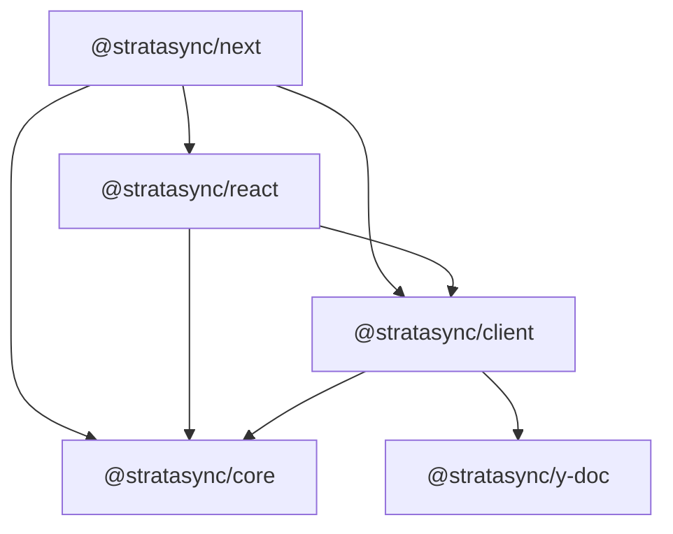
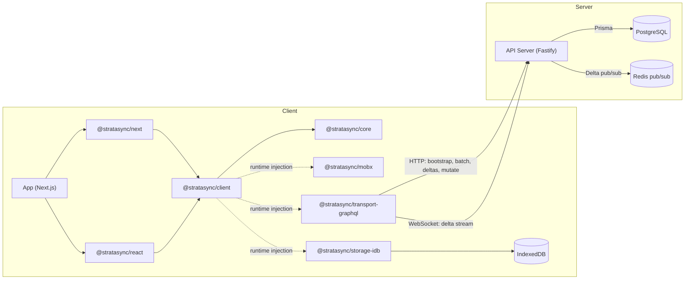

Strata Sync has a layered architecture. The core is framework-agnostic; adapters at the edges handle React, MobX, IndexedDB, and GraphQL. The sync protocol is based on [Linear's published design](/docs/architecture/sync-protocol#design-lineage).

## Package dependency graph

This graph shows compile-time (`package.json`) dependencies between Strata Sync packages:

Dependencies flow downward. `@stratasync/core` has zero runtime dependencies on any framework, storage engine, or transport, so you can test sync logic (delta application, rebase, transactions) in pure Node.js without a browser.

Storage (`@stratasync/storage-idb`), transport (`@stratasync/transport-graphql`), and reactivity (`@stratasync/mobx`) adapters implement interfaces defined in `@stratasync/core` and are injected at runtime via `SyncClientOptions`. You can swap adapters without changing the dependency graph.

## Layered architecture

Each layer builds on the one below it. For API details, see the individual [package docs](/docs/packages).

### Layer 1 -- Schema and metadata (`@stratasync/core`)

The foundation layer defines the data model. The `ModelRegistry` registers TypeScript classes decorated with `@ClientModel`, `@Property`, `@ManyToOne`, and `@OneToMany`, storing field metadata, relation metadata, load strategies, and a deterministic schema hash used for cache-busting and local database migrations.

### Layer 2 -- Runtime state (`@stratasync/core`)

The in-memory object pool and identity map. Every model instance lives in a `Map<id, ModelInstance>` keyed by model name and primary key, guaranteeing one object per record. A pluggable `ReactivityAdapter` interface notifies the UI layer when fields change without coupling to any specific reactivity library.

### Layer 3 -- Local persistence (`@stratasync/storage-idb`)

A durable local replica in IndexedDB storing model rows, sync metadata, the persistent outbox, and partial-index coverage. The `StorageAdapter` interface is transport-agnostic -- you could implement a SQLite adapter for server-side tools or tests without changing any other layer.

### Layer 4 -- Sync protocol (`@stratasync/client`)

The sync orchestrator and protocol state machine. This layer handles bootstrapping, delta streaming over WebSockets (with HTTP (Hypertext Transfer Protocol) fallback), outbox management with retry and idempotency keys, and field-level last-writer-wins rebase when server deltas conflict with pending local transactions.

### Layer 5 -- Transport (`@stratasync/transport-graphql`)

The wire protocol adapter. Moves data between client and server using NDJSON (Newline-Delimited JSON) streaming for bootstrap, GraphQL mutations with batch support, and WebSocket subscriptions for real-time deltas. The `TransportAdapter` interface is backend-agnostic.

### Layer 6 -- Reactivity (`@stratasync/mobx`)

The MobX adapter turns model instances into observables. When a delta updates a field, MobX notifies every component reading that field. Batch delta application wraps in a MobX transaction for atomic UI updates.

### Layer 7 -- Framework integration (`@stratasync/react`, `@stratasync/next`)

React hooks and providers connect the sync client to the component tree. The Next.js package adds server-side bootstrap prefetching for fast first paint. See the [React](/docs/packages/react) and [Next.js](/docs/packages/next) package docs for the full hook API.

## Full system architecture

## Design principles

Three principles guide the architecture:

1. **Core is deterministic, adapters at the edges** -- The delta applier, rebase algorithm, and transaction serializer produce the same output for the same input regardless of environment. Storage, transport, and reactivity are interfaces you can swap (IndexedDB for SQLite, GraphQL for REST, MobX for a custom solution) without touching the core.

2. **Offline is the default** -- Every read comes from the local store; every write goes to the persistent outbox. Network connectivity is an optimization, not a requirement.

3. **Server is the authority** -- The server assigns global ordering. Clients apply mutations optimistically, but confirmed state only advances through server-issued deltas. This prevents split-brain scenarios and keeps conflict resolution deterministic.
