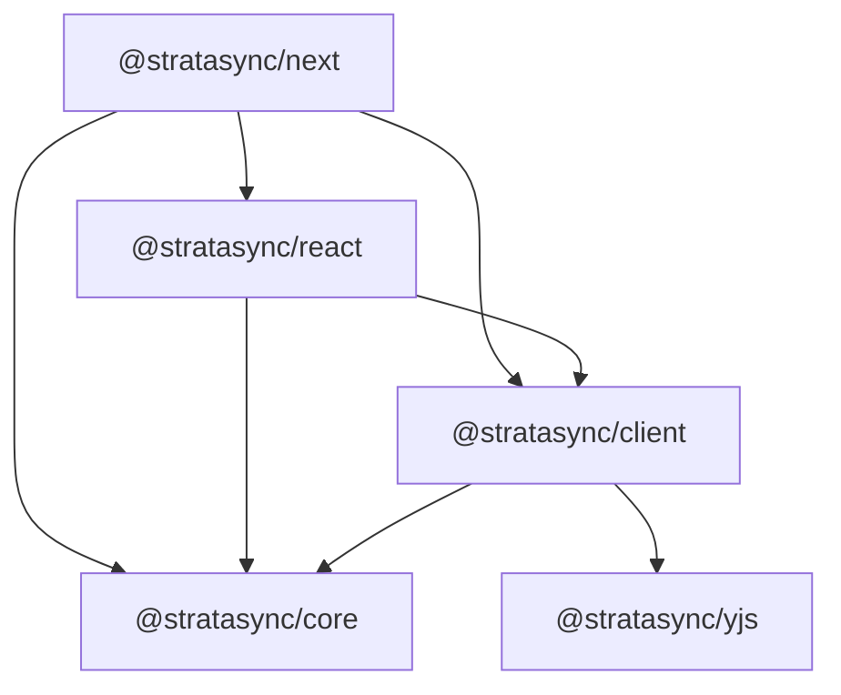
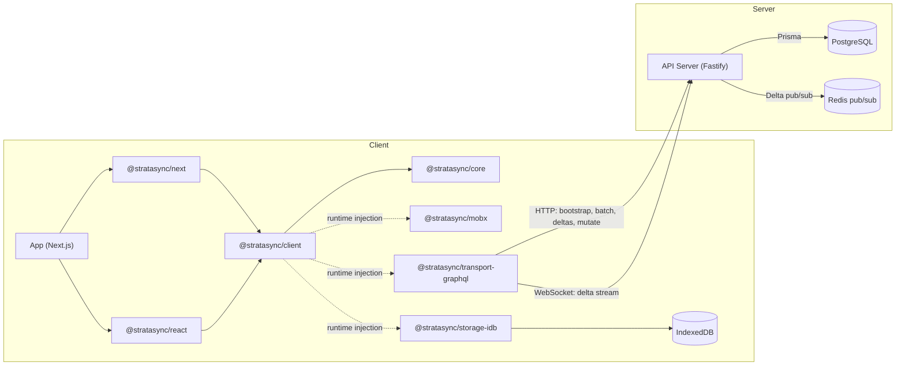

Strata Sync is structured as a stack of composable layers. The core is deterministic and framework-agnostic; React, MobX, IndexedDB, and GraphQL are pushed to adapter packages at the edges.

## Package dependency graph

The graph below shows **compile-time (package.json) dependencies** between Strata Sync packages:

Dependencies flow downward. `@stratasync/core` has no runtime dependencies on any framework, storage engine, or transport. This means you can test the core sync logic (delta application, rebase, transactions) in pure Node.js without a browser or React.

> **Note:** Storage (`@stratasync/storage-idb`), transport (`@stratasync/transport-graphql`), and reactivity (`@stratasync/mobx`) adapters are **not** compile-time dependencies of `@stratasync/client`. They implement interfaces defined in `@stratasync/core` and are injected at runtime via `SyncClientOptions`. This means you can swap adapters without changing the core dependency graph.

## Layered architecture

### Layer 1: Schema and metadata (`@stratasync/core`)

The foundation layer defines the data model. The `ModelRegistry` registers TypeScript classes you decorate with `@ClientModel`, `@Property`, `@ManyToOne`, and `@OneToMany`, and stores:

- **Field metadata** -- type, nullable, indexed, serializer, default value, ephemeral flag.
- **Relation metadata** -- foreign keys, inverse properties, lazy/eager loading, collection types.
- **Load strategy** -- `"instant"` (bootstrapped immediately), `"lazy"` (loaded on access), `"partial"` (loaded by index), `"explicitlyRequested"` (loaded only when asked), `"local"` (client-only).
- **Schema hash** -- A deterministic hash of all model definitions. The client uses this as a cache-busting key for bootstrap endpoints and as a local database migration trigger.

### Layer 2: Runtime state (`@stratasync/core`)

The in-memory object pool and identity map. Every model instance is stored in a `Map<id, ModelInstance>` keyed by model name and primary key. This ensures:

- **Identity** -- Exactly one object exists in memory for each model row. Multiple components accessing the same record get the same reference.
- **Reactivity** -- A pluggable `ReactivityAdapter` interface lets the core notify the UI layer when fields change. The core calls `reactivity.makeObservable()`, `reactivity.onFieldSet()`, and `reactivity.transaction()` without knowing whether MobX, Zustand, or nothing at all is underneath.
- **Lazy hydration** -- `LazyReference` (many-to-one) and `LazyCollection` (one-to-many) wrappers resolve relations by loading data from the local store or network on first access.

### Layer 3: Local persistence (`@stratasync/storage-idb`)

A durable local replica in IndexedDB. The storage adapter stores:

- **Model rows** -- One object store per model with secondary indexes for indexed fields.
- **Metadata** -- Schema hash, `lastSyncId`, subscribed sync groups, bootstrap completion flag.
- **Outbox** -- Persistent queue of pending transactions with state tracking (queued, sent, awaiting sync, failed).
- **Partial indexes** -- Coverage tracking for partially replicated models (`"for taskId=X, we have all Comments up to syncId=Y"`).

The `StorageAdapter` interface is transport-agnostic. You could implement a SQLite adapter for server-side tools or tests without changing any other layer.

### Layer 4: Sync protocol (`@stratasync/client`)

The sync orchestrator and protocol state machine. This layer handles:

- **Bootstrapping** -- Full or incremental initial load, comparing schema hashes, deciding between network and local bootstrap.
- **Delta streaming** -- WebSocket subscription for real-time server pushes. HTTP fallback for catch-up after disconnection.
- **Outbox management** -- Batching, retry, idempotency keys, and transaction state transitions.
- **Rebase** -- When a server delta conflicts with a pending local transaction, the rebase algorithm applies field-level last-writer-wins resolution while preserving the user's in-progress edits.

### Layer 5: Transport (`@stratasync/transport-graphql`)

The wire protocol adapter. Defines how data moves between client and server:

- **Bootstrap** -- Newline-Delimited JSON (NDJSON) streaming of model rows for efficient initial loads.
- **Batch load** -- Partial bootstrap for specific models or index values.
- **Mutations** -- GraphQL mutations with idempotency keys and batch support.
- **Delta subscription** -- WebSocket connection for real-time sync actions.
- **Catch-up** -- HTTP endpoint for fetching deltas after a `lastSyncId`.

The `TransportAdapter` interface is backend-agnostic. The GraphQL transport works with any server that implements the sync endpoints.

### Layer 6: Reactivity (`@stratasync/mobx`)

The MobX reactivity adapter turns model instances into MobX observables. When a delta arrives and updates a field, MobX automatically notifies every React component that reads that field. The adapter implements:

- `makeObservable(model, fieldDescriptors)` -- Makes all declared properties observable.
- `onFieldSet(model, field, oldValue, newValue)` -- Triggers MobX reactions on field assignment.
- `transaction(fn)` -- Wraps batch delta application in a MobX transaction for atomic UI updates.

### Layer 7: Framework integration (`@stratasync/react`, `@stratasync/next`)

React hooks and providers that connect the sync client to the component tree:

- **`SyncProvider`** -- Manages client lifecycle (start, stop, event subscriptions).
- **`useModel`** -- Suspense-based single record fetching.
- **`useQuery`** -- Reactive filtered/sorted list queries.
- **`useConnectionState`** -- Sync status, offline detection, pending count.
- **`useSyncClient`** -- Direct access to the sync client for mutations.

The Next.js package adds:

- **`prefetchBootstrap`** -- Server-side bootstrap data fetching for fast first paint.
- **`NextSyncProvider`** -- Provider that seeds the client from a server-rendered snapshot.

## Full system architecture

## Design principles

1. **Core is deterministic** -- The delta applier, rebase algorithm, and transaction serializer produce the same output for the same input, regardless of environment. This makes them testable and portable.

2. **Adapters at the edges** -- Storage, transport, and reactivity are interfaces, not implementations. You can swap IndexedDB for SQLite, GraphQL for REST, or MobX for a custom solution.

3. **Offline is the default** -- We designed the system to work offline first. Network connectivity is an optimization, not a requirement. Every read comes from the local store; every write goes to the persistent outbox.

4. **Server is the authority** -- The server assigns the global ordering. Clients may optimistically apply mutations, but the confirmed state only advances through server-taskd deltas. This prevents split-brain scenarios and makes conflict resolution deterministic.

5. **Minimal surface per package** -- Each package exports a focused API. The core doesn't know about React; the React package doesn't know about IndexedDB. This keeps bundle sizes small and upgrade paths clean.
