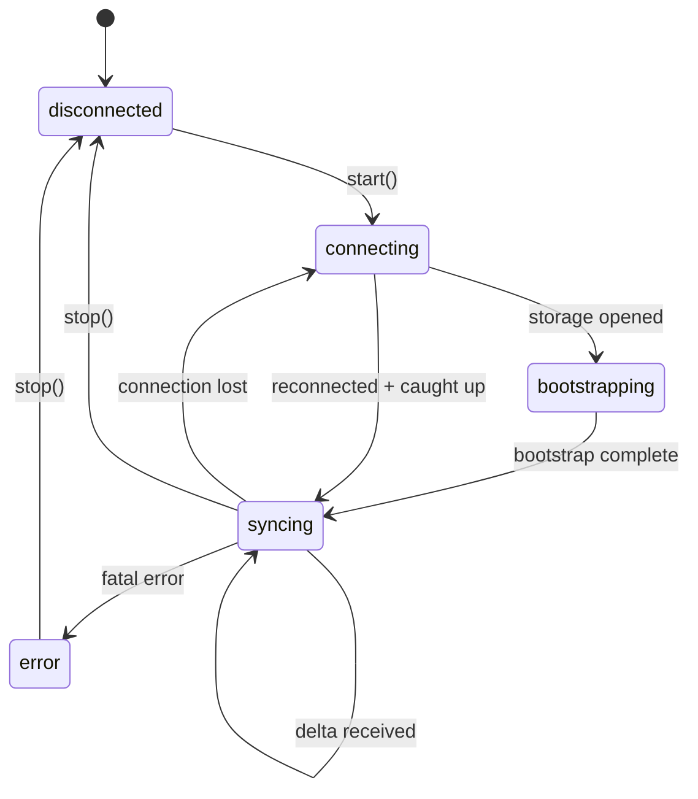

Strata Sync uses a **server-sequenced** sync model. The server assigns a monotonically increasing `syncId` to every committed change, creating a single global ordering that all clients follow.

### Design lineage

This protocol follows the server-sequenced sync architecture that Linear described in their engineering blog and conference talks. The core ideas — a monotonic append-only sync log, bootstrap + delta streaming, optimistic mutations with field-level last-writer-wins rebase — come from Linear's published design. Strata Sync's implementation is independent and adds capabilities not present in Linear's engine, including Yjs CRDT integration, built-in undo/redo, and pluggable adapters.

## The sync log

The core abstraction is a monotonic append-only log of **sync actions**, where each action represents a single change to a single model row.

| Field       | Description                                                                                          |
| ----------- | ---------------------------------------------------------------------------------------------------- |
| `id`        | The `syncId` -- a monotonically increasing integer assigned by the server.                           |
| `modelName` | Which model changed (for example, `"Task"` or `"User"`).                                             |
| `modelId`   | The primary key of the affected row.                                                                 |
| `action`    | The change type: `"I"` (insert), `"U"` (update), `"D"` (delete), `"A"` (archive), `"V"` (unarchive). |
| `data`      | The changed fields (for inserts and updates) or `null` (for deletes).                                |
| `groups`    | Optional sync group memberships for access control.                                                  |

A **delta packet** bundles one or more sync actions with a `lastSyncId` watermark:

```ts
interface DeltaPacket {
  lastSyncId: number;
  actions: SyncAction[];
}
```

The client tracks its own `lastSyncId` and advances it to `packet.lastSyncId` after applying each delta packet. This is the only mechanism by which confirmed state advances on the client.

## Client state machine

The sync client follows five states: `"disconnected"`, `"connecting"`, `"bootstrapping"`, `"syncing"`, and `"error"`.



**Connecting** opens local storage (IndexedDB), reads the stored `schemaHash` and `lastSyncId`, and decides whether to do a full or local bootstrap. **Bootstrapping** loads the initial dataset into the local store and identity map (see [Bootstrap modes](#bootstrap-modes)). **Syncing** applies incoming delta packets from the WebSocket stream, persists them to IndexedDB, rebases pending local transactions, and advances `lastSyncId`. **Error** captures fatal failures; call `stop()` to return to `disconnected`.

### Reconnecting and catch-up

On WebSocket disconnect, the client returns to `connecting` and retries with exponential backoff. After reconnecting, it fetches all deltas after its stored `lastSyncId` via the HTTP catch-up endpoint, transitions back to `syncing`, and retries any pending outbox transactions.

## Bootstrap modes

The `bootstrapMode` option on `SyncClientOptions` controls the initial load strategy.

| Mode      | Behavior                                                                                                    |
| --------- | ----------------------------------------------------------------------------------------------------------- |
| `"auto"`  | Full bootstrap if no local data exists; local bootstrap with delta catch-up otherwise. This is the default. |
| `"full"`  | Always performs a full bootstrap from the server, ignoring any local data.                                  |
| `"local"` | Bootstraps from local data only. Useful offline or when displaying cached data before connecting.           |

**Full bootstrap** streams an NDJSON (Newline-Delimited JSON) response of model rows from the server's bootstrap endpoint, writes each row to IndexedDB, hydrates the identity map, and sets `lastSyncId` from the final metadata line. **Local bootstrap** reads all model rows from IndexedDB into the identity map, then fetches and applies deltas from the server starting at the stored `lastSyncId`.

## Model load strategies

Each model class declares a load strategy that controls when and how you sync it.

| Strategy                | Description                                                                                                                            |
| ----------------------- | -------------------------------------------------------------------------------------------------------------------------------------- |
| `"instant"`             | Included in the initial bootstrap. The full dataset syncs eagerly. Best for small, frequently accessed models (users, teams, labels).  |
| `"lazy"`                | Not included in bootstrap. Loads from the server on first access via `ensureModel()` or `useModel()`. Cached locally after first load. |
| `"partial"`             | Loads by index values (for example, all comments for a specific task). The client tracks partial index coverage.                       |
| `"explicitlyRequested"` | Never loaded automatically. Fetched only when you explicitly request it.                                                               |
| `"local"`               | Client-only data that never syncs to the server. Useful for UI state or drafts.                                                        |

## Idempotency

Every outgoing mutation carries an idempotency key composed of `clientId + clientTxId`. The server uses this key to deduplicate, so resending after a crash or network drop is safe.

```ts
{
  clientId: "c_abc123",      // Unique per browser/device, persisted in IndexedDB
  clientTxId: "tx_def456",   // Unique per transaction
}
```

## Schema hash and migrations

`computeSchemaHash()` produces a deterministic 8-character hex hash from all model definitions. If the stored hash doesn't match the computed hash on startup, the client triggers a full re-bootstrap instead of applying deltas against an incompatible schema.

## Wire primitives

The transport layer uses three standard wire formats.

**Model row** (bootstrap and batch load):

```json
{ "__class": "Task", "id": "abc", "title": "Bug fix", "status": "open" }
```

**Sync action** (delta stream):

```json
{
  "id": 42,
  "modelName": "Task",
  "modelId": "abc",
  "action": "U",
  "data": { "status": "closed", "updatedAt": "2025-01-15T00:00:00Z" }
}
```

**Mutation request** (outbox to server):

```json
{
  "transactions": [
    {
      "clientTxId": "tx_def456",
      "clientId": "c_abc123",
      "modelName": "Task",
      "modelId": "abc",
      "action": "update",
      "data": { "status": "closed" },
      "original": { "status": "open" }
    }
  ]
}
```

## Sync groups and partial replication

Sync groups control which data each client can see. Every model row can belong to one or more groups (workspace IDs, team IDs, user IDs), and the server filters bootstrap, batch, and delta responses by the client's subscribed groups. For setup details, see the [sync groups guide](/docs/guides/sync-groups).
