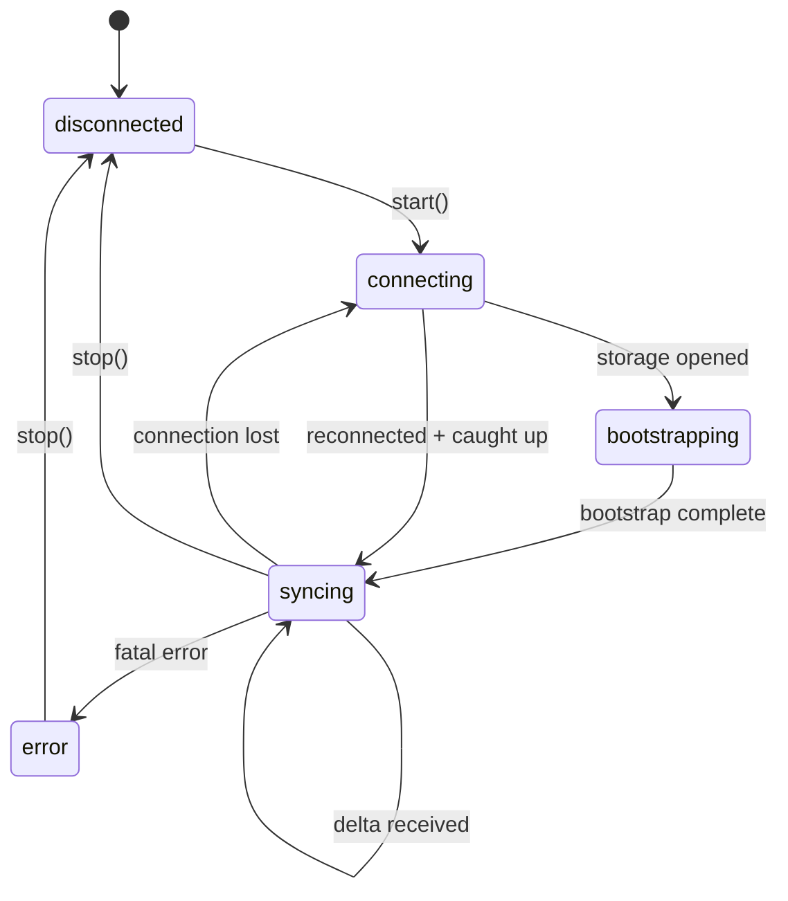

The server assigns a monotonically increasing `syncId` to every committed change, creating a single global ordering that all clients follow.

### Design lineage

Based on the server-sequenced sync architecture Linear described but never open-sourced. Extended with Yjs CRDT integration, undo/redo, and pluggable adapters.

## The sync log

A monotonic append-only log of **sync actions**. Each action represents a single change to a single model row.

| Field       | Description                                                                                          |
| ----------- | ---------------------------------------------------------------------------------------------------- |
| `id`        | The `syncId`: a monotonically increasing integer assigned by the server.                             |
| `modelName` | Which model changed (for example, `"Task"` or `"User"`).                                             |
| `modelId`   | The primary key of the affected row.                                                                 |
| `action`    | The change type: `"I"` (insert), `"U"` (update), `"D"` (delete), `"A"` (archive), `"V"` (unarchive). |
| `data`      | The changed fields (for inserts and updates) or `null` (for deletes).                                |
| `groups`    | Optional sync group memberships for access control.                                                  |

A **delta packet** bundles sync actions with a `lastSyncId` watermark:

```ts
interface DeltaPacket {
  lastSyncId: number;
  actions: SyncAction[];
}
```

The client tracks its own `lastSyncId` and advances it after applying each delta packet. This is the only way confirmed state advances on the client.

## Client state machine

Five states: `"disconnected"`, `"connecting"`, `"bootstrapping"`, `"syncing"`, and `"error"`.



**Connecting** opens IndexedDB, reads `schemaHash` and `lastSyncId`, and decides on full or local bootstrap. **Bootstrapping** loads the initial dataset (see [Bootstrap modes](#bootstrap-modes)). **Syncing** applies delta packets, persists to IndexedDB, rebases pending transactions, and advances `lastSyncId`. **Error** captures fatal failures; call `stop()` to return to `disconnected`.

### Reconnecting and catch-up

On disconnect, the client retries with exponential backoff. After reconnecting, it fetches deltas after `lastSyncId` via the HTTP catch-up endpoint, transitions to `syncing`, and retries pending outbox transactions.

## Bootstrap modes

Set via `bootstrapMode` on `SyncClientOptions`.

| Mode      | Behavior                                                                                                    |
| --------- | ----------------------------------------------------------------------------------------------------------- |
| `"auto"`  | Full bootstrap if no local data exists; local bootstrap with delta catch-up otherwise. This is the default. |
| `"full"`  | Always performs a full bootstrap from the server, ignoring any local data.                                  |
| `"local"` | Bootstraps from local data only. Useful offline or when displaying cached data before connecting.           |

**Full bootstrap** streams NDJSON model rows from the server, writes to IndexedDB, hydrates the identity map, and sets `lastSyncId`. **Local bootstrap** reads from IndexedDB into the identity map, then fetches deltas from the stored `lastSyncId`.

## Model load strategies

Each model declares a load strategy that controls when it syncs.

| Strategy                | Description                                                                                                                            |
| ----------------------- | -------------------------------------------------------------------------------------------------------------------------------------- |
| `"instant"`             | Included in the initial bootstrap. The full dataset syncs eagerly. Best for small, frequently accessed models (users, teams, labels).  |
| `"lazy"`                | Not included in bootstrap. Loads from the server on first access via `ensureModel()` or `useModel()`. Cached locally after first load. |
| `"partial"`             | Loads by index values (for example, all comments for a specific task). The client tracks partial index coverage.                       |
| `"explicitlyRequested"` | Never loaded automatically. Fetched only when you explicitly request it.                                                               |
| `"local"`               | Client-only data that never syncs to the server. Useful for UI state or drafts.                                                        |

## Idempotency

Every mutation carries an idempotency key (`clientId + clientTxId`). The server deduplicates, so resending after a crash or network drop is safe.

```ts
{
  clientId: "c_abc123",      // Unique per browser/device, persisted in IndexedDB
  clientTxId: "tx_def456",   // Unique per transaction
}
```

## Schema hash and migrations

`computeSchemaHash()` produces a deterministic 8-character hex hash from all model definitions. If the stored hash doesn't match on startup, the client triggers a full re-bootstrap.

## Wire primitives

Three wire formats:

**Model row** (bootstrap and batch load):

```json
{ "__class": "Task", "id": "abc", "title": "Bug fix", "status": "open" }
```

**Sync action** (delta stream):

```json
{
  "id": 42,
  "modelName": "Task",
  "modelId": "abc",
  "action": "U",
  "data": { "status": "closed", "updatedAt": "2025-01-15T00:00:00Z" }
}
```

**Mutation request** (outbox to server):

```json
{
  "transactions": [
    {
      "clientTxId": "tx_def456",
      "clientId": "c_abc123",
      "modelName": "Task",
      "modelId": "abc",
      "action": "update",
      "data": { "status": "closed" },
      "original": { "status": "open" }
    }
  ]
}
```

## Sync groups and partial replication

Sync groups control which data each client sees. Model rows belong to one or more groups (workspace IDs, team IDs, user IDs), and the server filters responses by the client's subscribed groups. See the [load strategies guide](/docs/guides/load-strategies).
