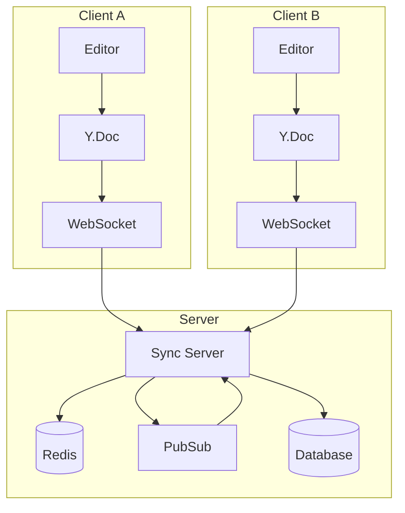
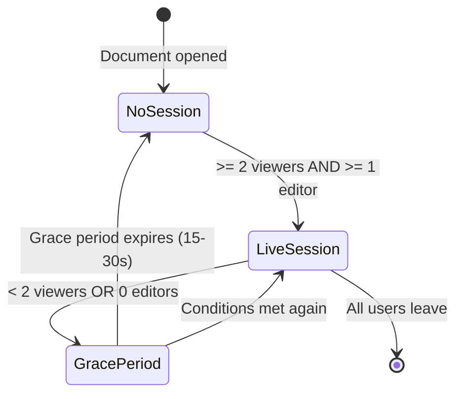

Strata Sync uses Yjs, a CRDT (Conflict-free Replicated Data Type) library, for collaborative fields. Unlike Operational Transform (OT), CRDTs merge without a central server.

Regular model fields use server-sequenced sync with last-writer-wins semantics. Rich-text or collaborative fields use Yjs CRDTs for character-level merge resolution.

## Architecture overview

Each client's editor binds to a local Yjs document that syncs through the shared WebSocket connection.



Key design decisions:

- **Demand-driven sessions**: The server starts a live editing session only when at least two users view the same document and one is editing. This cuts server resource usage by roughly 96%.
- **Shared WebSocket**: Yjs updates piggyback on the same WebSocket connection used for regular sync, so you don't need additional connections.
- **Standard sync as fallback**: Each client syncs periodically through the standard protocol. If the live editing subsystem goes down, no data is lost.

## Setting up YjsDocumentManager

The `YjsDocumentManager` from `@stratasync/y-doc` manages Yjs document instances and their connection to the sync server.

```ts
import { YjsDocumentManager } from "@stratasync/y-doc";
import type { YjsTransportAdapter } from "@stratasync/transport-graphql";

// The transport adapter provides the WebSocket connection
const yjsTransport: YjsTransportAdapter = transport.createYjsAdapter();

const documentManager = new YjsDocumentManager({
  transport: yjsTransport,
});
```

### Getting a document

Call `getDocument` to get a Yjs `Y.Doc` for a specific model instance. The manager creates, caches, and connects documents automatically.

```ts
import type { DocumentKey } from "@stratasync/y-doc";

const docKey: DocumentKey = {
  entityType: "Task",
  entityId: taskId,
  fieldName: "description",
};

// Get or create a Y.Doc for a specific task's description
const doc = documentManager.getDocument(docKey);

// Access the shared text type
const yText = doc.getText("content");
```

The `"content"` key is the shared Y.Text type name used for all collaborative fields. Multiple clients accessing the same document ID receive the same shared state.

### Connection management

```ts
// Connect to start receiving/sending updates
documentManager.connect(docKey);

// Check connection state
const state = documentManager.getConnectionState(docKey);
// "disconnected" | "connecting" | "syncing" | "connected"

// Disconnect when done
documentManager.disconnect(docKey);
```

## Using the useYjsDocument hook

In React, the `useYjsDocument` hook from `@stratasync/react` provides a reactive interface to Yjs documents.

```tsx
"use client";

import { useYjsDocument } from "@stratasync/react";

export function CollaborativeEditor({ taskId }: { taskId: string }) {
  const { doc, connectionState, content } = useYjsDocument({
    entityType: "Task",
    entityId: taskId,
    fieldName: "description",
  });

  if (connectionState === "connecting") {
    return <p>Connecting to editing session...</p>;
  }

  if (!doc) {
    return <p>Loading document...</p>;
  }

  // `content` is a reactive string derived from doc.getText("content")
  // `doc` is the raw Y.Doc for editor binding
  return (
    <div>
      <p>Status: {connectionState}</p>
      <Editor doc={doc} />
    </div>
  );
}
```

## Presence tracking with useYjsPresence

The `useYjsPresence` hook shows who's viewing or editing a document, along with cursor position and selection state.

```tsx
"use client";

import { useYjsPresence } from "@stratasync/react";

export function PresenceBar({ taskId }: { taskId: string }) {
  const { startViewing, stopViewing, isViewing, isEditing } = useYjsPresence({
    entityType: "Task",
    entityId: taskId,
    fieldName: "description",
  });

  return (
    <div className="flex gap-2">
      <div className="text-sm">Viewing: {isViewing ? "Yes" : "No"}</div>
      <div className="text-sm">Editing: {isEditing ? "Yes" : "No"}</div>
    </div>
  );
}
```

### Managing presence state

You signal viewing and editing state through these methods.

```ts
const { startViewing, stopViewing, focus, blur, isViewing, isEditing } =
  useYjsPresence({
    entityType: "Task",
    entityId: taskId,
    fieldName: "description",
  });

// Start viewing when you navigate to the document
startViewing();

// Signal editing when you focus an input
focus(); // Automatically calls startViewing() if not already viewing

// Signal blur when you leave the input
blur();

// Stop viewing when you navigate away
stopViewing();
```

You can also use the `trackFocus` and `trackVisibility` options to handle these events automatically through a ref callback.

## Session lifecycle

The server creates live editing sessions on demand and tears them down after a grace period.



When no live session exists, each client operates independently using the standard sync protocol. Clients send edits as CRDT deltas rather than full document content, so all clients merge seamlessly when a live session starts.

## Integration with rich-text editors

### Tiptap

[Tiptap](https://tiptap.dev) has first-class Yjs support through `@tiptap/extension-collaboration`. Disable Tiptap's built-in history since Yjs handles undo/redo.

```tsx
"use client";

import { useEditor, EditorContent } from "@tiptap/react";
import StarterKit from "@tiptap/starter-kit";
import Collaboration from "@tiptap/extension-collaboration";
import CollaborationCursor from "@tiptap/extension-collaboration-cursor";
import { useYjsDocument } from "@stratasync/react";

export function TiptapEditor({ taskId }: { taskId: string }) {
  const { doc, connectionState, participants } = useYjsDocument({
    entityType: "Task",
    entityId: taskId,
    fieldName: "description",
  });

  const editor = useEditor(
    {
      extensions: [
        StarterKit.configure({ history: false }),
        Collaboration.configure({ document: doc ?? undefined }),
        CollaborationCursor.configure({
          provider: null, // Strata Sync handles transport
          user: { name: "Current User", color: "#3b82f6" },
        }),
      ],
    },
    [doc]
  );

  if (connectionState === "connecting" || !doc) {
    return <p>Connecting...</p>;
  }

  return (
    <div>
      <div className="flex gap-1 mb-2">
        {participants.map((p) => (
          <span
            key={p.userId}
            className="text-xs px-2 py-1 rounded bg-blue-100"
          >
            {p.userId} {p.isEditing && "(editing)"}
          </span>
        ))}
      </div>
      <EditorContent editor={editor} />
    </div>
  );
}
```

### ProseMirror (direct)

If you use ProseMirror directly, bind through `y-prosemirror`.

```ts
import { ySyncPlugin, yCursorPlugin, yUndoPlugin } from "y-prosemirror";

const plugins = [ySyncPlugin(yText), yCursorPlugin(awareness), yUndoPlugin()];
```

Get the `yText` and `awareness` objects from the Yjs document and presence manager. For the full message protocol and internal details, see the [@stratasync/y-doc API reference](/docs/packages/sync-y-doc).

## Offline collaboration

You can edit a document while offline -- the client applies changes to the local `Y.Doc` and buffers them. When connectivity returns, the standard sync mechanism sends CRDT deltas to the server. If another user edited the same document in the meantime, both sets of changes merge automatically at the character level without conflicts.

## Next steps

- [Conflict Resolution](/docs/guides/conflict-resolution) -- How non-CRDT fields handle concurrent edits.
- [Offline-First Patterns](/docs/guides/offline-first) -- Deep dive into the outbox and reconnection flow.
- [@stratasync/y-doc API Reference](/docs/packages/sync-y-doc) -- Full API for `YjsDocumentManager`, `YjsPresenceManager`, and the message protocol.
