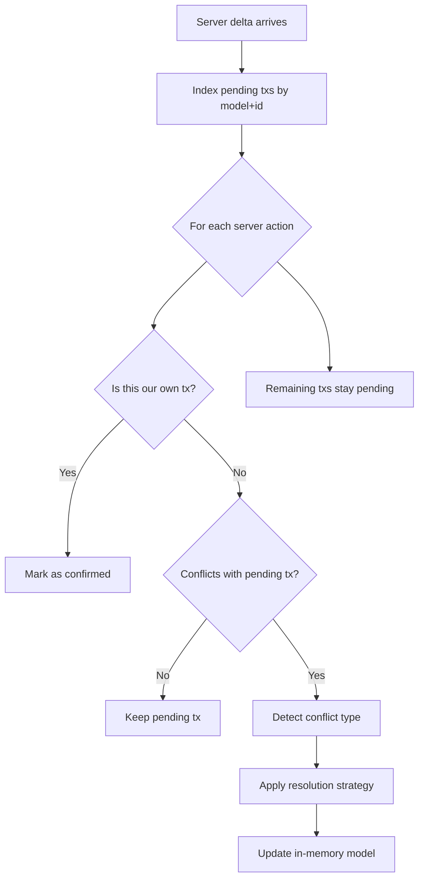

When multiple clients modify the same data, the rebase algorithm resolves conflicts automatically. This guide covers detection, strategies, and manual intervention.

## Server-sequenced model

The server assigns global order. See [Sync protocol](/docs/architecture/sync-protocol) for details.

## How rebase works

When a server delta arrives for a model with pending local transactions, the client replays local changes on top of the new server state.



Three outcomes per server action:

1. **Own transaction**: `clientTxId` matches: confirmed and removed from outbox.
2. **No conflict**: Different model/ID or different fields. Pending transaction stays.
3. **Conflict**: Overlapping fields. Conflict type detected and strategy applied.

Each pending update stores `{ modelId, payload, original }` where `original[field]` is the value when editing started:

```
Client original state:  { title: "Draft",  status: "open"   }
Client pending update:  { title: "Final" }                     <- user changed title
Server delta arrives:   { title: "Draft",  status: "closed" }  <- another user changed status
```

With field-level conflict detection enabled (the default), `title` has a pending client change but no server change, so no conflict. `status` has a server change but no pending client change, so no conflict. Both changes merge to `{ title: "Final", status: "closed" }`.

## Conflict types

Four conflict types:

| Type            | Local action | Server action | Example                          |
| --------------- | ------------ | ------------- | -------------------------------- |
| `update-update` | Update       | Update        | Both changed the same field      |
| `update-delete` | Update       | Delete        | Client edited, server deleted    |
| `delete-update` | Delete       | Update        | Client deleted, server edited    |
| `insert-insert` | Insert       | Insert        | Both inserted the same ID (rare) |

Archive (`A`) and Unarchive (`V`) actions are normalized to Update (`U`) for conflict detection.

## Resolution strategies

Three strategies:

### server-wins (default)

Accepts the server's version and discards the pending transaction.

```ts
const client = createSyncClient({
  // ...adapters
  rebaseStrategy: "server-wins",
});
```

**When to use**: Most applications. Works well for form fields, status changes, and assignments.

### client-wins

Re-applies the local change on top of server state. Pending transaction stays and retransmits.

```ts
const client = createSyncClient({
  // ...adapters
  rebaseStrategy: "client-wins",
});
```

**When to use**: Rare. Useful when the local user's intent should always take priority, such as a force-update action.

### merge

Combines server and client changes at the field level. Non-overlapping fields merge; overlapping fields use the client's value.

```ts
const client = createSyncClient({
  // ...adapters
  rebaseStrategy: "merge",
  fieldLevelConflicts: true,
});
```

**When to use**: When different users typically edit different fields of the same record.

## Choosing a strategy

| Scenario                          | Recommended strategy                                                              |
| --------------------------------- | --------------------------------------------------------------------------------- |
| General purpose (forms, settings) | `rebaseStrategy: "merge"` + `fieldLevelConflicts: true` (default)                 |
| Simple apps, few concurrent users | `rebaseStrategy: "server-wins"` (default)                                         |
| Collaborative text editing        | Use [Yjs CRDTs](/docs/guides/collaborative-editing) instead                       |
| Critical data (finance, legal)    | `rebaseStrategy: "server-wins"` with `rebaseConflict` event handler for custom UI |
| Force-update operations           | `rebaseStrategy: "client-wins"`                                                   |

## Field-level conflict detection

Enabled by default. Only changes to the _same fields_ trigger a conflict. Disable to treat any concurrent edit to the same model+ID as a conflict:

```ts
const client = createSyncClient({
  // ...adapters
  fieldLevelConflicts: false, // any overlapping model+ID is a conflict
});
```

- **Overlapping fields**: Both client and server changed the same field (true conflict).
- **Non-overlapping fields**: Client and server changed different fields (no conflict, changes coexist).

Most concurrent edits affect different fields, so field-level detection greatly reduces conflicts.

## Handling conflicts manually

For critical data requiring user intervention, use the `rebaseConflict` event. `insert-insert` conflicts always resolve to `manual` since they typically indicate a bug in ID generation.

### Subscribing to the rebaseConflict event

Subscribe for logging, UI notifications, or custom resolution:

```ts
import { createSyncClient } from "@stratasync/client";

const client = createSyncClient({
  // ...adapters
});

client.onEvent((event) => {
  if (event.type !== "rebaseConflict") {
    return;
  }

  // event.modelName, event.modelId, event.conflictType, event.resolution
  switch (event.conflictType) {
    case "update-update":
      // Two users edited the same field on the same model
      break;
    case "update-delete":
      // Local user edited a record that the server deleted
      break;
    case "delete-update":
      // Local user deleted a record that the server updated
      break;
    case "insert-insert":
      // Both clients created a record with the same ID
      break;
  }
});
```

### Surfacing conflicts in the UI

Let users choose how to resolve conflicts:

```tsx
"use client";

import { useState, useEffect } from "react";
import { useSyncClient } from "@stratasync/react";

interface ConflictRecord {
  modelName: string;
  modelId: string;
  conflictType: string;
  resolution: string;
}

export function ConflictResolver() {
  const { client } = useSyncClient();
  const [conflicts, setConflicts] = useState<ConflictRecord[]>([]);

  useEffect(() => {
    const unsubscribe = client.onEvent((event) => {
      if (event.type !== "rebaseConflict") {
        return;
      }
      setConflicts((prev) => [
        ...prev,
        {
          modelName: event.modelName,
          modelId: event.modelId,
          conflictType: event.conflictType,
          resolution: event.resolution,
        },
      ]);
    });
    return unsubscribe;
  }, [client]);

  if (conflicts.length === 0) {
    return null;
  }

  function dismiss(conflict: ConflictRecord) {
    setConflicts((prev) => prev.filter((c) => c !== conflict));
  }

  async function retryWithClient(conflict: ConflictRecord) {
    await client.update(conflict.modelName, conflict.modelId, {});
    setConflicts((prev) => prev.filter((c) => c !== conflict));
  }

  return (
    <div className="fixed bottom-4 right-4 bg-white border rounded-lg shadow-lg p-4 max-w-md">
      <h3 className="font-bold mb-2">
        {conflicts.length} conflict{conflicts.length > 1 ? "s" : ""} detected
      </h3>
      {conflicts.map((conflict, i) => (
        <div key={i} className="border-t pt-2 mt-2">
          <p className="text-sm">
            {conflict.conflictType} on {conflict.modelName}:{conflict.modelId}
          </p>
          <div className="flex gap-2 mt-1">
            <button
              onClick={() => dismiss(conflict)}
              className="text-xs px-2 py-1 bg-gray-100 rounded"
            >
              Keep server version
            </button>
            <button
              onClick={() => retryWithClient(conflict)}
              className="text-xs px-2 py-1 bg-blue-100 rounded"
            >
              Keep my changes
            </button>
          </div>
        </div>
      ))}
    </div>
  );
}
```

## Concurrent edit examples

Two users editing the same task, starting from `{ title: "Draft", status: "open", priority: "low" }`.

### Field-level conflicts + merge (recommended)

User A changes `title` to `"Final Report"`. User B changes `status` to `"in-review"`. The changes affect different fields, so no conflict fires. Both users converge on `{ title: "Final Report", status: "in-review" }`.

```ts
const client = createSyncClient({
  // ...adapters
  rebaseStrategy: "merge",
  fieldLevelConflicts: true,
});
```

### Without field-level conflicts (server-wins)

With `fieldLevelConflicts: false`, any concurrent edit to the same model+ID is a conflict. User A's pending title change and User B's pending status change both get discarded in favor of the server version. One user's change is lost.

```ts
const client = createSyncClient({
  // ...adapters
  fieldLevelConflicts: false,
});
```

This is why `fieldLevelConflicts: true` (the default) with `rebaseStrategy: "merge"` is the recommended configuration.

## Next steps

- [Offline-First Patterns](/docs/guides/offline-first): How mutations flow through the outbox.
- [Collaborative Editing](/docs/guides/collaborative-editing): CRDT-based editing that avoids field-level conflicts.
- [sync-core Transactions API](/docs/packages/core/transactions): Low-level transaction creation and management.
