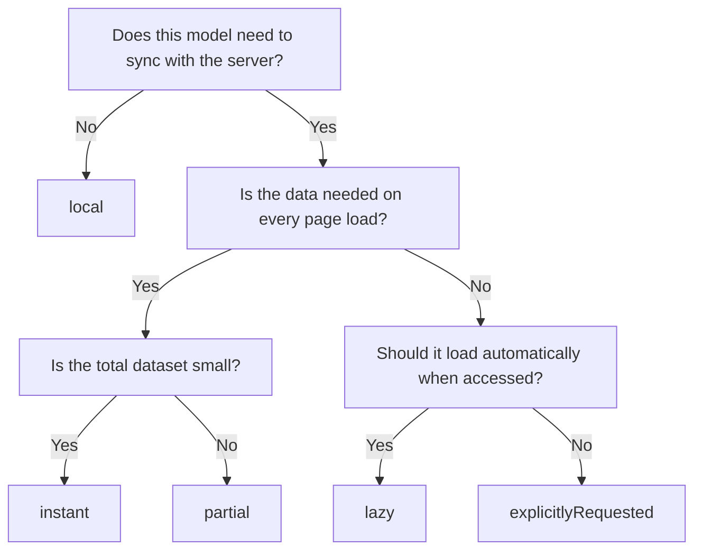
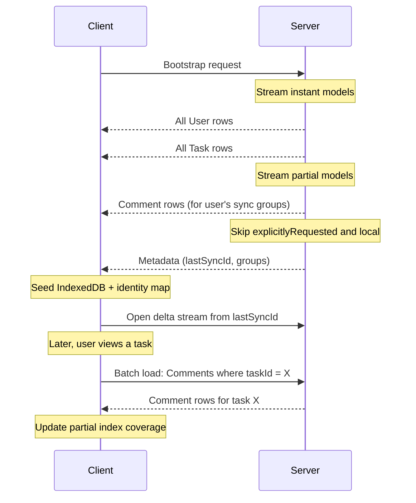

Load strategies control when each model's data arrives on the client. You set them per model via the `@ClientModel` decorator, and they determine bootstrap timing, transfer volume, and offline availability.

## Decision tree

Pick a strategy by walking this flowchart from top to bottom.



## Strategy reference

Each strategy offers a different balance between availability, bandwidth, and control.

| Strategy              | Behavior                                                                               | Best for                                                                   | Trade-off                                                                   |
| --------------------- | -------------------------------------------------------------------------------------- | -------------------------------------------------------------------------- | --------------------------------------------------------------------------- |
| `instant`             | Bootstrap includes all instances; data available from first render                     | Small, always-needed models (users, teams, labels)                         | Adds to bootstrap payload size                                              |
| `lazy`                | Not included in bootstrap; fetched on first access via hooks or relationship traversal | Models needed only on some pages (attachments, activity feeds)             | First access has network latency; only accessed instances available offline |
| `partial`             | Loads a relevant subset at bootstrap; fetches remaining instances on demand            | High-volume models where only a slice matters (comments, notifications)    | Requires partial index tracking in IndexedDB                                |
| `explicitlyRequested` | Never auto-loaded; fetched only via `client.get()` or `client.query()`                 | Large or sensitive models loaded on specific pages (audit logs, analytics) | No data present until you request it                                        |
| `local`               | Never synced; stored only in IndexedDB and the in-memory identity map                  | Client-only state (drafts, UI preferences, unsent messages)                | No server backup or cross-device access                                     |

## Code examples

Set the strategy in the `@ClientModel` decorator.

### instant

```ts
@ClientModel("User", { loadStrategy: "instant" })
export class User extends Model {
  /* ... */
}
```

### lazy

```ts
@ClientModel("Attachment", { loadStrategy: "lazy" })
export class Attachment extends Model {
  /* ... */
}
```

### partial

```ts
@ClientModel("Comment", {
  loadStrategy: "partial",
  partialLoadMode: "regular",
})
export class Comment extends Model {
  /* ... */
}
```

Partial load modes control bootstrap priority:

| Mode          | Behavior                                                     |
| ------------- | ------------------------------------------------------------ |
| `full`        | Load the complete subset during bootstrap (highest priority) |
| `regular`     | Load the subset at normal priority                           |
| `lowPriority` | Load the subset after higher-priority models                 |

### explicitlyRequested

```ts
@ClientModel("AuditLog", { loadStrategy: "explicitlyRequested" })
export class AuditLog extends Model {
  /* ... */
}
```

### local

```ts
@ClientModel("DraftMessage", { loadStrategy: "local" })
export class DraftMessage extends Model {
  /* ... */
}
```

## Quick reference table

Use this table to map common model types to strategies.

| Model type         | Example             | Strategy               | Reasoning                    |
| ------------------ | ------------------- | ---------------------- | ---------------------------- |
| Core entities      | User, Team, Project | `instant`              | Always needed, small dataset |
| Primary work items | Task                | `instant` or `partial` | Depends on volume            |
| Secondary content  | Comment, Attachment | `partial` or `lazy`    | Only needed in context       |
| Large datasets     | AuditLog, Analytics | `explicitlyRequested`  | Loaded on specific pages     |
| Sensitive data     | AdminSettings       | `explicitlyRequested`  | Access-controlled            |
| Client-only state  | Draft, UIPreference | `local`                | Never synced                 |

## Performance implications

Three areas deserve attention when you assign strategies across your schema.

- **Bootstrap payload size** -- The bootstrap includes all `instant` models and the relevant subset of `partial` models. If it's slow, move large models to `partial` or `lazy`, limit models via the `models` option in `prefetchBootstrap`, or enable compression in `serializeBootstrapSnapshot`.
- **Identity map memory** -- Every loaded instance lives in the in-memory identity map. Use `partial` instead of `instant` for high-volume models, and set `usedForPartialIndexes` on models that serve only as foreign key targets.
- **Delta stream filtering** -- The delta stream delivers updates for all accessible models, but the client applies deltas only for instances already in the identity map. `instant` models apply all deltas immediately; `lazy`, `partial`, and `explicitlyRequested` models apply deltas only for loaded instances; `local` models never receive deltas.

## Complete example

This configuration shows all five strategies working together in a task management app.

```ts
// Always loaded -- small dataset
@ClientModel("User", { loadStrategy: "instant" })
export class User extends Model {
  /* ... */
}

// Always loaded -- core work items
@ClientModel("Task", { loadStrategy: "instant" })
export class Task extends Model {
  /* ... */
}

// Partially loaded -- fetch comments for viewed tasks
@ClientModel("Comment", {
  loadStrategy: "partial",
  partialLoadMode: "regular",
  usedForPartialIndexes: true,
})
export class Comment extends Model {
  /* ... */
}

// Only loaded when explicitly requested
@ClientModel("AuditLog", { loadStrategy: "explicitlyRequested" })
export class AuditLog extends Model {
  /* ... */
}

// Local-only draft state
@ClientModel("CommentDraft", { loadStrategy: "local" })
export class CommentDraft extends Model {
  /* ... */
}
```

### Bootstrap flow for mixed strategies

The server streams `instant` models first, then `partial` subsets, and skips `explicitlyRequested` and `local` models entirely. After seeding IndexedDB, the client opens a delta stream and fetches additional data on demand.



## Next steps

- [Model relationships](/docs/guides/model-relationships) -- How load strategies interact with relationship decorators.
- [SSR bootstrap](/docs/guides/ssr-bootstrap) -- Prefetch bootstrap data on the server for instant first paint.
- [sync-core models API](/docs/packages/sync-core/models) -- Full API reference for model decorators and options.
