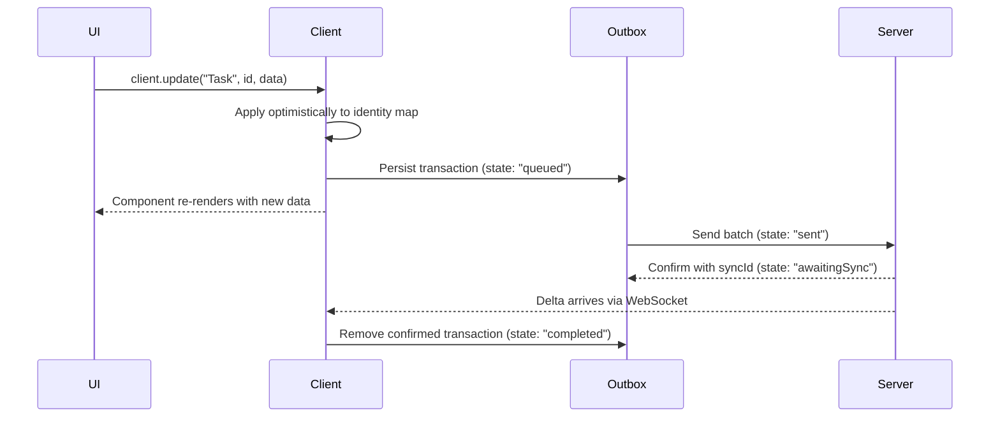
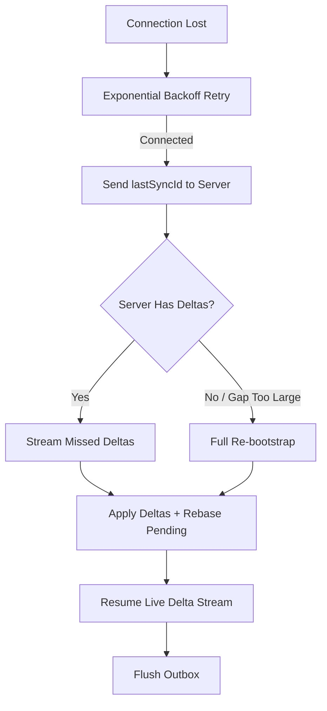

Strata Sync works offline by default. Every mutation applies locally, persists in an outbox, and syncs when connectivity returns.

## How the outbox works

Every mutation (create, update, delete, archive) follows the same path through the outbox.



The storage adapter stores the outbox in IndexedDB, so pending mutations survive page reloads, browser crashes, and device restarts. When the client starts, it replays any `queued` or `sent` transactions. For the full outbox lifecycle and state definitions, see [Data flow](/docs/architecture/data-flow).

## Optimistic updates

The client applies every change to the in-memory identity map before any network request, so the UI reflects your intent without waiting for the server.

```tsx
"use client";

import { observer } from "mobx-react-lite";
import { useSyncClient } from "@stratasync/react";

const TaskStatus = observer(function TaskStatus({
  taskId,
}: {
  taskId: string;
}) {
  const { client } = useSyncClient();

  async function markDone() {
    await client.update("Task", taskId, {
      status: "done",
      updatedAt: new Date().toISOString(),
    });
  }

  return <button onClick={markDone}>Mark as Done</button>;
});
```

If the server rejects the mutation, the client rolls back the optimistic update and emits a `rebaseConflict` event. See [Conflict resolution](/docs/guides/conflict-resolution) for details.

## Monitoring connection state

Use `useConnectionState`, `useIsOffline`, and `usePendingCount` to track sync status and display appropriate UI.

```tsx
"use client";

import {
  useConnectionState,
  useIsOffline,
  usePendingCount,
} from "@stratasync/react";

export function SyncIndicator() {
  const { status, error } = useConnectionState();
  const isOffline = useIsOffline();
  const { count, hasPending } = usePendingCount();

  if (error) {
    return <div>Sync error: {error.message}</div>;
  }

  if (isOffline) {
    return (
      <div>
        Offline
        {hasPending && <span> -- {count} pending changes</span>}
      </div>
    );
  }

  return (
    <div>
      Connected ({status})
      {hasPending && <span> -- syncing {count} changes</span>}
    </div>
  );
}
```

See [Hooks](/docs/packages/react/hooks) for the full state reference.

## Pending mutation tracking

`usePendingCount` gives you real-time visibility into unsynced mutations.

```tsx
"use client";

import { usePendingCount } from "@stratasync/react";

export function SaveIndicator() {
  const { count, hasPending } = usePendingCount();

  if (!hasPending) {
    return <span>All changes saved</span>;
  }

  return (
    <span>
      Saving {count} {count === 1 ? "change" : "changes"}...
    </span>
  );
}
```

### Preventing data loss on tab close

Combine `usePendingCount` with the `beforeunload` event to warn users before they navigate away with unsynced changes.

```tsx
"use client";

import { useEffect } from "react";
import { usePendingCount } from "@stratasync/react";

export function PendingGuard() {
  const { hasPending } = usePendingCount();

  useEffect(() => {
    if (!hasPending) {
      return;
    }

    function handleBeforeUnload(event: BeforeUnloadEvent) {
      event.preventDefault();
    }

    window.addEventListener("beforeunload", handleBeforeUnload);
    return () => {
      window.removeEventListener("beforeunload", handleBeforeUnload);
    };
  }, [hasPending]);

  return null;
}
```

## Reconnection flow

When the connection drops, Strata Sync recovers automatically through exponential backoff and delta catch-up.



Key behaviors:

- **Exponential backoff**: Retries at 1s, 2s, 4s, up to 30s, with 20% jitter to avoid thundering herd.
- **Delta catch-up**: The client sends its `lastSyncId` and receives only missed deltas. No full re-download in most cases.
- **Outbox replay**: The client retransmits any queued or previously-sent mutations. Each mutation carries an idempotency key, so duplicate delivery is safe.
- **Rebase**: If server deltas affect the same models as pending mutations, the client rebases automatically. See [Conflict resolution](/docs/guides/conflict-resolution).

## Best practices

Follow these guidelines to build a polished offline experience.

- Show sync status in your app shell so users know when they're offline and how many changes are pending.
- Assume every mutation succeeds and show the result immediately: handle failures as exceptions, not expected outcomes.
- Structure mutations to be idempotent so replaying them after reconnection produces the same result.
- Register a listener for `rebaseConflict` events to handle cases where an optimistic update conflicts with a server change. See [Conflict resolution](/docs/guides/conflict-resolution).
- Use the `PendingGuard` pattern (shown above) to prevent data loss when the user closes the tab with unsynced mutations.

## Complete example: offline-capable task manager

This component ties together all the patterns into a single offline-capable view.

```tsx
"use client";

import { observer } from "mobx-react-lite";
import { Suspense } from "react";
import {
  useQuery,
  useSyncClient,
  useIsOffline,
  usePendingCount,
} from "@stratasync/react";

function OfflineBanner() {
  const isOffline = useIsOffline();
  const { count, hasPending } = usePendingCount();

  if (!isOffline) return null;

  return (
    <div>
      You are offline.
      {hasPending && (
        <span>
          {" "}
          {count} {count === 1 ? "change" : "changes"} will sync when you
          reconnect.
        </span>
      )}
    </div>
  );
}

const TaskList = observer(function TaskList() {
  const { client } = useSyncClient();
  const { data: tasks } = useQuery("Task", {
    where: (task) => (task as Record<string, string>).status !== "archived",
    orderBy: (a, b) =>
      (b as Record<string, string>).createdAt.localeCompare(
        (a as Record<string, string>).createdAt
      ),
  });

  async function addTask() {
    await client.create("Task", {
      title: "New task",
      status: "todo",
      createdAt: new Date().toISOString(),
      updatedAt: new Date().toISOString(),
    });
  }

  async function toggleDone(taskId: string, currentStatus: string) {
    await client.update("Task", taskId, {
      status: currentStatus === "done" ? "todo" : "done",
      updatedAt: new Date().toISOString(),
    });
  }

  return (
    <div>
      <button onClick={addTask}>Add Task</button>
      <ul>
        {tasks.map((task) => {
          const t = task as Record<string, string>;
          return (
            <li key={t.id}>
              <input
                type="checkbox"
                checked={t.status === "done"}
                onChange={() => toggleDone(t.id, t.status)}
              />
              <span>{t.title}</span>
            </li>
          );
        })}
      </ul>
    </div>
  );
});

export default function TaskManager() {
  return (
    <div>
      <OfflineBanner />
      <Suspense fallback={<p>Loading...</p>}>
        <TaskList />
      </Suspense>
    </div>
  );
}
```
