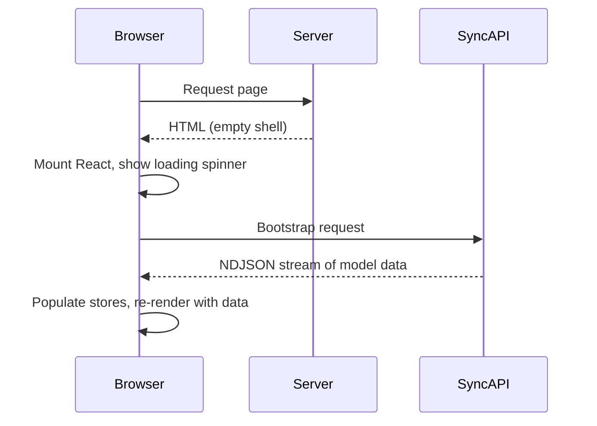
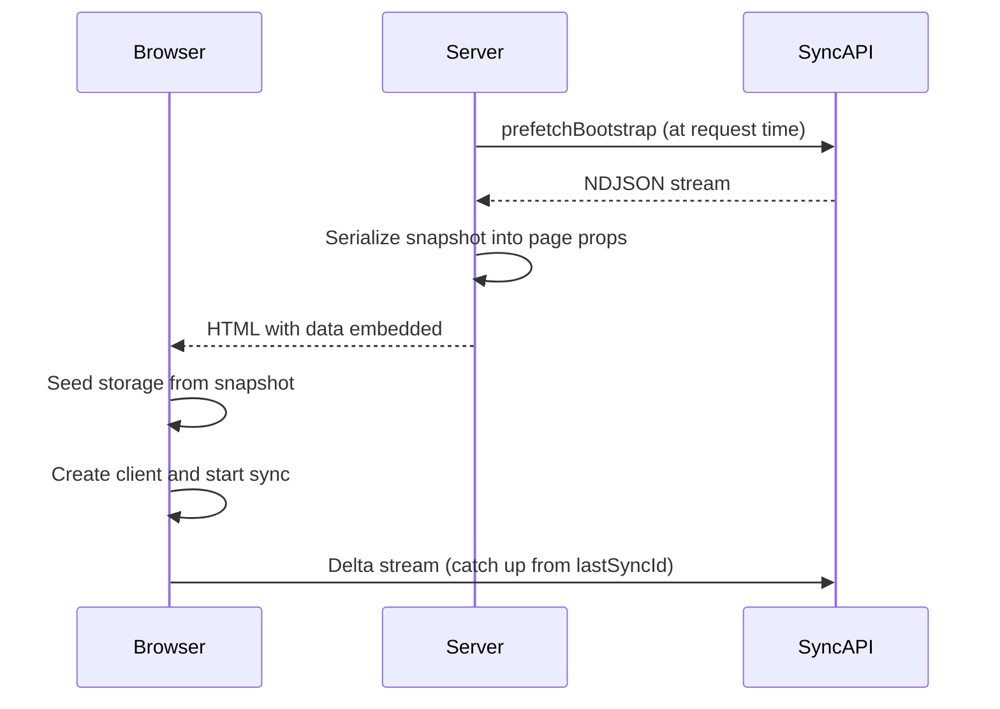

Server-side rendering (SSR) bootstrap eliminates loading spinners on first paint. You prefetch data on the server, serialize it into the HTML response, and seed client storage on load. The client then starts its delta stream from where the server left off.

## Why bootstrap matters

Without SSR bootstrap, the browser receives an empty shell, mounts React, shows a spinner, and only then fetches data from the sync API. With bootstrap, the server embeds data directly in the HTML response, so users see content immediately with no layout shift.

### Without SSR bootstrap



### With SSR bootstrap



## Prefetching on the server

`prefetchBootstrap` from `@stratasync/next/server` fetches a full bootstrap snapshot from your sync API. Call it in a Server Component or `generateMetadata` context.

```ts
import {
  prefetchBootstrap,
  serializeBootstrapSnapshot,
} from "@stratasync/next/server";

const snapshot = await prefetchBootstrap({
  endpoint: "https://api.example.com/sync",
  authorization: `Bearer ${userToken}`,
  models: ["Task", "User", "Team"],
  timeout: 10_000,
});
```

See [Server utilities](/docs/packages/next/server) for all `prefetchBootstrap` options.

### Snapshot shape

The returned `BootstrapSnapshot` contains every model instance the user can access, streamed as NDJSON from the sync API. The `lastSyncId` field tells the client where to start its delta stream.

```ts
interface BootstrapSnapshot {
  version: 1;
  schemaHash: string;
  lastSyncId: number;
  firstSyncId?: number;
  groups: string[];
  rows: ModelRow[];
  fetchedAt: number;
  rowCount?: number;
}
```

## Serializing and passing to the client

Server Components can't pass complex objects directly to Client Components. Use `serializeBootstrapSnapshot` to encode the snapshot into a transferable payload. When `compress: true` is set, the payload is gzip-compressed and base64-encoded via `CompressionStream` when available, falling back to plain JSON otherwise.

```ts
const payload = await serializeBootstrapSnapshot(snapshot, {
  compress: true,
});
```

## Seeding storage from bootstrap

`seedStorageFromBootstrap` populates IndexedDB with the server-prefetched snapshot. Call it before creating or starting the sync client so queries return data on the first render.

```ts
import { seedStorageFromBootstrap } from "@stratasync/next";
import { createIndexedDbStorage } from "@stratasync/storage-idb";

const storage = createIndexedDbStorage({ name: "my-app" });

const result = await seedStorageFromBootstrap({
  storage,
  snapshot: payload,
  dbName: "my-app",
  clearExisting: true,
  closeAfter: true,
});

if (!result.applied) {
  // Schema changed -- need a full re-bootstrap
}
```

See [Client utilities](/docs/packages/next/client) for the full `seedStorageFromBootstrap` API.

## Stale checking

Detect whether a cached or delayed snapshot has gone stale before seeding.

```ts
import { isBootstrapSnapshotStale } from "@stratasync/next/server";

const snapshot = await prefetchBootstrap({ endpoint });

if (isBootstrapSnapshotStale(snapshot, 30_000)) {
  // Snapshot is older than 30 seconds -- re-fetch or let the delta stream catch up
}
```

Staleness rarely causes problems in practice because the client's delta stream catches up immediately after hydration.

## Complete Next.js App Router example

This example shows the server layout fetching data, the client provider seeding storage, and a page consuming synced data.

### Server layout

```tsx
// app/layout.tsx
import {
  prefetchBootstrap,
  serializeBootstrapSnapshot,
} from "@stratasync/next/server";
import { cookies } from "next/headers";
import { Providers } from "./providers";

export default async function RootLayout({
  children,
}: {
  children: React.ReactNode;
}) {
  const cookieStore = await cookies();
  const token = cookieStore.get("session")?.value;
  let bootstrap = null;

  if (token) {
    try {
      const snapshot = await prefetchBootstrap({
        endpoint: process.env.SYNC_API_URL!,
        authorization: `Bearer ${token}`,
      });
      bootstrap = await serializeBootstrapSnapshot(snapshot, {
        compress: true,
      });
    } catch {
      // Graceful degradation -- client will bootstrap normally
    }
  }

  return (
    <html lang="en">
      <body>
        <Providers bootstrap={bootstrap}>{children}</Providers>
      </body>
    </html>
  );
}
```

### Client provider

```tsx
// app/providers.tsx
"use client";

import { useRef, useCallback } from "react";
import { NextSyncProvider, seedStorageFromBootstrap } from "@stratasync/next";
import type { BootstrapSnapshotPayload } from "@stratasync/next/server";
import { createSyncClient } from "@stratasync/client";
import { createIndexedDbStorage } from "@stratasync/storage-idb";
import { createGraphQLTransport } from "@stratasync/transport-graphql";
import { createMobXReactivity } from "@stratasync/mobx";
import { schema } from "../lib/schema";

export function Providers({
  children,
  bootstrap,
}: {
  children: React.ReactNode;
  bootstrap: BootstrapSnapshotPayload | null;
}) {
  const seeded = useRef(false);

  const clientFactory = useCallback(() => {
    const client = createSyncClient({
      schema,
      storage: createIndexedDbStorage({ name: "my-app" }),
      transport: createGraphQLTransport({
        endpoint: "/api/graphql",
        syncEndpoint: "/api/sync",
        wsEndpoint: "wss://api.example.com/sync",
        auth: { getAccessToken: async () => "token" },
      }),
      reactivity: createMobXReactivity(),
    });

    if (bootstrap && !seeded.current) {
      seeded.current = true;
      seedStorageFromBootstrap({
        storage: createIndexedDbStorage({ name: "my-app" }),
        snapshot: bootstrap,
        dbName: "my-app",
        clearExisting: true,
        closeAfter: true,
      });
    }

    return client;
  }, [bootstrap]);

  return (
    <NextSyncProvider client={clientFactory} loading={<p>Loading...</p>}>
      {children}
    </NextSyncProvider>
  );
}
```

### Page using synced data

```tsx
// app/tasks/task-list.tsx
"use client";

import { observer } from "mobx-react-lite";
import { useQuery } from "@stratasync/react";

export const TaskList = observer(function TaskList() {
  const { data: tasks, isLoading } = useQuery("Task", {
    orderBy: (a, b) =>
      (b as Record<string, string>).createdAt.localeCompare(
        (a as Record<string, string>).createdAt
      ),
  });

  if (isLoading) return <p>Loading...</p>;

  return (
    <ul>
      {tasks.map((task) => {
        const t = task as Record<string, string>;
        return (
          <li key={t.id}>
            <strong>{t.title}</strong> {t.status}
          </li>
        );
      })}
    </ul>
  );
});
```

The key pattern: the server prefetches and serializes the snapshot, the client seeds IndexedDB before the sync client starts, and `NextSyncProvider` calls `client.start()` once ready. Because storage is pre-populated, `useQuery` and `useModel` hooks return data on the first render with no loading state.

## Incremental hydration

After the initial bootstrap seed, the client opens a delta stream starting from `lastSyncId`. Any changes that occurred between the server render and client hydration arrive through this stream and update the stores automatically, making the transition from server-rendered to live data seamless.

## Next steps

- [Offline-First Patterns](/docs/guides/offline-first) -- How the client handles connectivity loss after bootstrap.
- [Load Strategies](/docs/guides/load-strategies) -- Control which models you include in the bootstrap.
- [Next.js package reference](/docs/packages/next) -- Full API docs for server and client exports.
