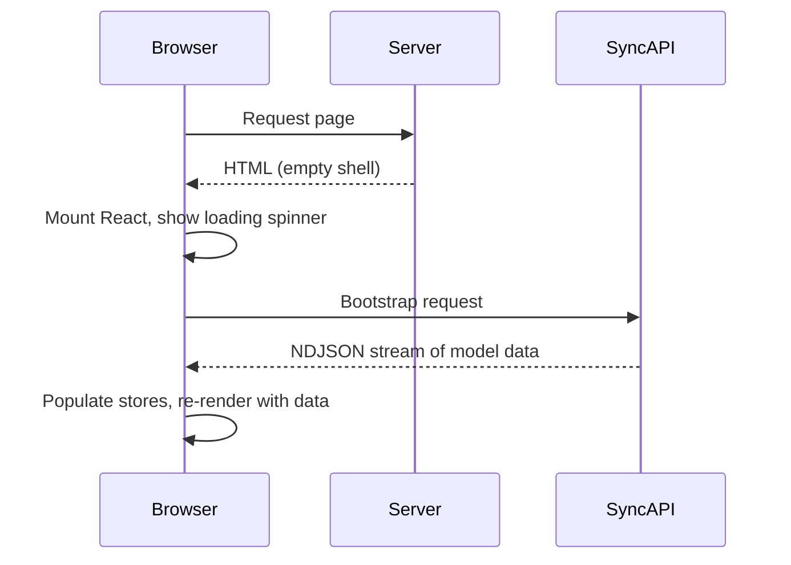
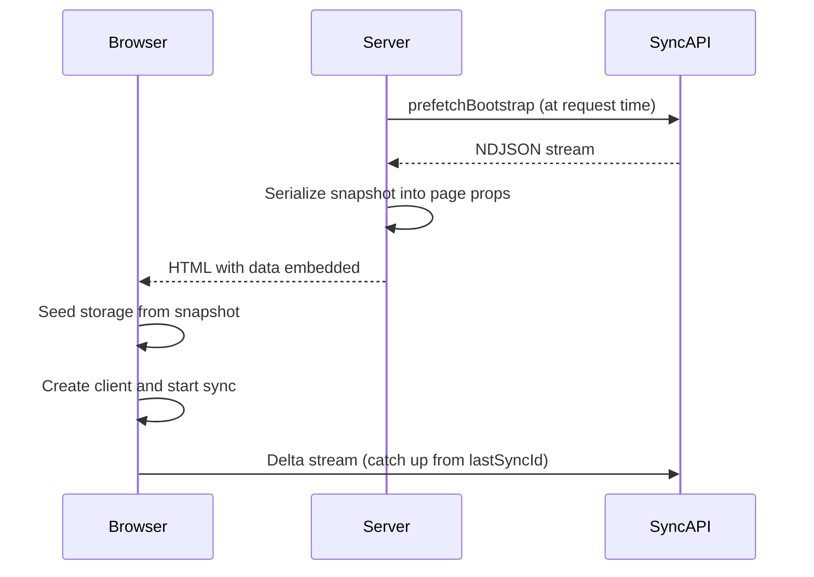

Prefetch data on the server, embed it in the HTML, and seed client storage. The client starts its delta stream from where the server left off: no loading spinners.

## Why bootstrap matters

Without SSR bootstrap, the browser shows a spinner while fetching from the sync API. With bootstrap, data is embedded in the HTML response: users see content immediately.

### Without SSR bootstrap



### With SSR bootstrap



## Prefetching on the server

Call `prefetchBootstrap` in a Server Component or `generateMetadata`:

```ts
import {
  prefetchBootstrap,
  serializeBootstrapSnapshot,
} from "@stratasync/next/server";

const snapshot = await prefetchBootstrap({
  endpoint: "https://api.example.com/sync",
  authorization: `Bearer ${userToken}`,
  models: ["Task", "User", "Team"],
  timeout: 10_000,
});
```

See [Server utilities](/docs/packages/next/server) for all `prefetchBootstrap` options.

### Snapshot shape

Contains all accessible model instances. `lastSyncId` tells the client where to start its delta stream.

```ts
interface BootstrapSnapshot {
  version: 1;
  schemaHash: string;
  lastSyncId: number;
  firstSyncId?: number;
  groups: string[];
  rows: ModelRow[];
  fetchedAt: number;
  rowCount?: number;
}
```

## Serializing and passing to the client

Encode the snapshot for transfer across the Server/Client Component boundary. With `compress: true`, data is gzip-compressed and base64-encoded.

```ts
const payload = await serializeBootstrapSnapshot(snapshot, {
  compress: true,
});
```

## Seeding storage from bootstrap

Populate IndexedDB before starting the sync client so queries return data on first render.

```ts
import { seedStorageFromBootstrap } from "@stratasync/next";
import { createIndexedDbStorage } from "@stratasync/storage-idb";

const storage = createIndexedDbStorage({ name: "my-app" });

const result = await seedStorageFromBootstrap({
  storage,
  snapshot: payload,
  dbName: "my-app",
  clearExisting: true,
  closeAfter: true,
});

if (!result.applied) {
  // Schema changed -- need a full re-bootstrap
}
```

See [Client utilities](/docs/packages/next/client) for the full `seedStorageFromBootstrap` API.

## Stale checking

Check if a snapshot is too old before seeding:

```ts
import { isBootstrapSnapshotStale } from "@stratasync/next/server";

const snapshot = await prefetchBootstrap({ endpoint });

if (isBootstrapSnapshotStale(snapshot, 30_000)) {
  // Snapshot is older than 30 seconds -- re-fetch or let the delta stream catch up
}
```

Staleness rarely matters: the delta stream catches up immediately after hydration.

## Complete Next.js App Router example

Server layout fetches data, client provider seeds storage, page consumes synced data.

### Server layout

```tsx
// app/layout.tsx
import {
  prefetchBootstrap,
  serializeBootstrapSnapshot,
} from "@stratasync/next/server";
import { cookies } from "next/headers";
import { Providers } from "./providers";

export default async function RootLayout({
  children,
}: {
  children: React.ReactNode;
}) {
  const cookieStore = await cookies();
  const token = cookieStore.get("session")?.value;
  let bootstrap = null;

  if (token) {
    try {
      const snapshot = await prefetchBootstrap({
        endpoint: process.env.SYNC_API_URL!,
        authorization: `Bearer ${token}`,
      });
      bootstrap = await serializeBootstrapSnapshot(snapshot, {
        compress: true,
      });
    } catch {
      // Graceful degradation -- client will bootstrap normally
    }
  }

  return (
    <html lang="en">
      <body>
        <Providers bootstrap={bootstrap}>{children}</Providers>
      </body>
    </html>
  );
}
```

### Client provider

```tsx
// app/providers.tsx
"use client";

import { useRef, useCallback } from "react";
import { NextSyncProvider, seedStorageFromBootstrap } from "@stratasync/next";
import type { BootstrapSnapshotPayload } from "@stratasync/next/server";
import { createSyncClient } from "@stratasync/client";
import { createIndexedDbStorage } from "@stratasync/storage-idb";
import { createGraphQLTransport } from "@stratasync/transport-graphql";
import { createMobXReactivity } from "@stratasync/mobx";
import { schema } from "../lib/schema";

export function Providers({
  children,
  bootstrap,
}: {
  children: React.ReactNode;
  bootstrap: BootstrapSnapshotPayload | null;
}) {
  const seeded = useRef(false);

  const clientFactory = useCallback(() => {
    const client = createSyncClient({
      schema,
      storage: createIndexedDbStorage({ name: "my-app" }),
      transport: createGraphQLTransport({
        endpoint: "/api/graphql",
        syncEndpoint: "/api/sync",
        wsEndpoint: "wss://api.example.com/sync/ws",
        auth: { getAccessToken: async () => "token" },
      }),
      reactivity: createMobXReactivity(),
    });

    if (bootstrap && !seeded.current) {
      seeded.current = true;
      seedStorageFromBootstrap({
        storage: createIndexedDbStorage({ name: "my-app" }),
        snapshot: bootstrap,
        dbName: "my-app",
        clearExisting: true,
        closeAfter: true,
      });
    }

    return client;
  }, [bootstrap]);

  return (
    <NextSyncProvider client={clientFactory} loading={<p>Loading...</p>}>
      {children}
    </NextSyncProvider>
  );
}
```

### Page using synced data

```tsx
// app/tasks/task-list.tsx
"use client";

import { observer } from "mobx-react-lite";
import { useQuery } from "@stratasync/react";

export const TaskList = observer(function TaskList() {
  const { data: tasks, isLoading } = useQuery("Task", {
    orderBy: (a, b) =>
      (b as Record<string, string>).createdAt.localeCompare(
        (a as Record<string, string>).createdAt
      ),
  });

  if (isLoading) return <p>Loading...</p>;

  return (
    <ul>
      {tasks.map((task) => {
        const t = task as Record<string, string>;
        return (
          <li key={t.id}>
            <strong>{t.title}</strong> {t.status}
          </li>
        );
      })}
    </ul>
  );
});
```

The server prefetches and serializes, the client seeds IndexedDB before start, and `NextSyncProvider` calls `client.start()`. Because storage is pre-populated, hooks return data on the first render.

## Incremental hydration

After seeding, the client opens a delta stream from `lastSyncId`. Changes between server render and client hydration arrive automatically, making the transition seamless.
