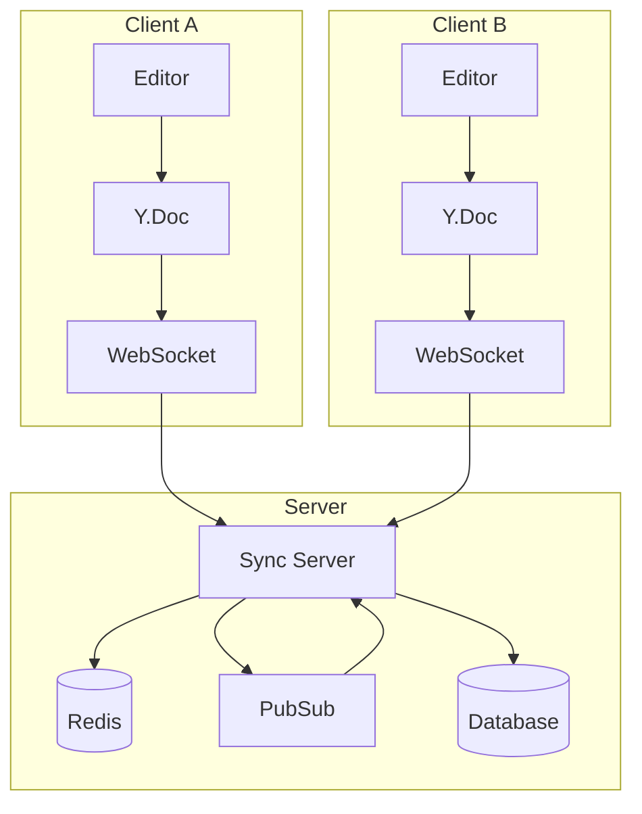
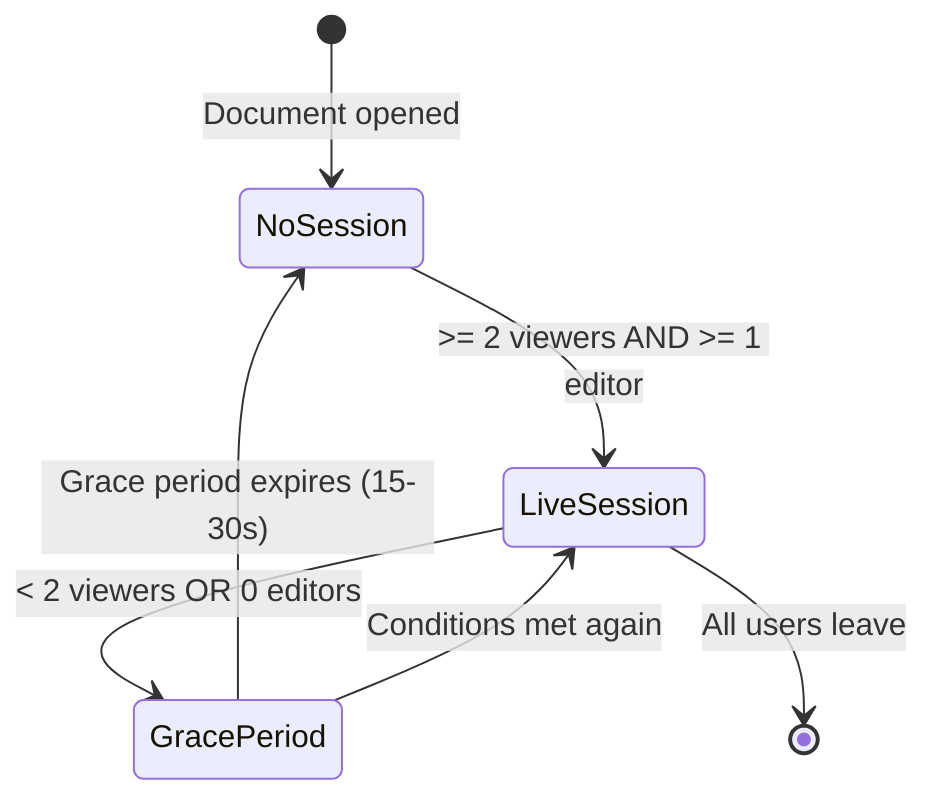

Regular fields use server-sequenced LWW sync. Collaborative fields use Yjs CRDTs for character-level merge: no central server needed for conflict resolution.

## Architecture overview

Each client binds to a local Yjs document that syncs through the shared WebSocket.



- **Demand-driven sessions**: Live editing starts only when 2+ users view a document and one is editing, cutting server usage by ~96%.
- **Shared WebSocket**: Yjs updates piggyback on the existing sync connection.
- **Standard sync fallback**: If live editing goes down, no data is lost.

## Setting up YjsDocumentManager

`YjsDocumentManager` manages Yjs document instances and their server connection.

```ts
import { YjsDocumentManager } from "@stratasync/y-doc";

// The transport adapter provides the WebSocket connection
const yjsTransport = transport.getYjsTransport();

const documentManager = new YjsDocumentManager({
  transport: yjsTransport,
});
```

### Getting a document

Get a `Y.Doc` for a model instance. Documents are created, cached, and connected automatically.

```ts
import type { DocumentKey } from "@stratasync/y-doc";

const docKey: DocumentKey = {
  entityType: "Task",
  entityId: taskId,
  fieldName: "description",
};

// Get or create a Y.Doc for a specific task's description
const doc = documentManager.getDocument(docKey);

// Access the shared text type
const yText = doc.getText("content");
```

`"content"` is the shared Y.Text type name. Multiple clients with the same document ID share state.

### Connection management

```ts
// Connect to start receiving/sending updates
documentManager.connect(docKey);

// Check connection state
const state = documentManager.getConnectionState(docKey);
// "disconnected" | "connecting" | "syncing" | "connected"

// Disconnect when done
documentManager.disconnect(docKey);
```

## Using the useYjsDocument hook

`useYjsDocument` provides a reactive interface to Yjs documents in React.

```tsx
"use client";

import { useYjsDocument } from "@stratasync/react";

export function CollaborativeEditor({ taskId }: { taskId: string }) {
  const { doc, connectionState, content } = useYjsDocument({
    entityType: "Task",
    entityId: taskId,
    fieldName: "description",
  });

  if (connectionState === "connecting") {
    return <p>Connecting to editing session...</p>;
  }

  if (!doc) {
    return <p>Loading document...</p>;
  }

  // `content` is a reactive string derived from doc.getText("content")
  // `doc` is the raw Y.Doc for editor binding
  return (
    <div>
      <p>Status: {connectionState}</p>
      <Editor doc={doc} />
    </div>
  );
}
```

## Presence tracking with useYjsPresence

Shows who's viewing or editing a document.

```tsx
"use client";

import { useYjsPresence } from "@stratasync/react";

export function PresenceBar({ taskId }: { taskId: string }) {
  const { startViewing, stopViewing, isViewing, isEditing } = useYjsPresence({
    entityType: "Task",
    entityId: taskId,
    fieldName: "description",
  });

  return (
    <div className="flex gap-2">
      <div className="text-sm">Viewing: {isViewing ? "Yes" : "No"}</div>
      <div className="text-sm">Editing: {isEditing ? "Yes" : "No"}</div>
    </div>
  );
}
```

### Managing presence state

```ts
const { startViewing, stopViewing, focus, blur, isViewing, isEditing } =
  useYjsPresence({
    entityType: "Task",
    entityId: taskId,
    fieldName: "description",
  });

// Start viewing when you navigate to the document
startViewing();

// Signal editing when you focus an input
focus(); // Automatically calls startViewing() if not already viewing

// Signal blur when you leave the input
blur();

// Stop viewing when you navigate away
stopViewing();
```

Use `trackFocus` and `trackVisibility` to handle these automatically via a ref callback.

## Session lifecycle

Sessions start on demand and tear down after a grace period.



Without a live session, clients operate independently via standard sync. Edits are CRDT deltas, so all clients merge seamlessly when a session starts.

## Integration with rich-text editors

### Tiptap

[Tiptap](https://tiptap.dev) has first-class Yjs support. Disable its built-in history since Yjs handles undo/redo.

```tsx
"use client";

import { useEditor, EditorContent } from "@tiptap/react";
import StarterKit from "@tiptap/starter-kit";
import Collaboration from "@tiptap/extension-collaboration";
import CollaborationCursor from "@tiptap/extension-collaboration-cursor";
import { useYjsDocument } from "@stratasync/react";

export function TiptapEditor({ taskId }: { taskId: string }) {
  const { doc, connectionState, participants } = useYjsDocument({
    entityType: "Task",
    entityId: taskId,
    fieldName: "description",
  });

  const editor = useEditor(
    {
      extensions: [
        StarterKit.configure({ history: false }),
        Collaboration.configure({ document: doc ?? undefined }),
        CollaborationCursor.configure({
          provider: null, // Strata Sync handles transport
          user: { name: "Current User", color: "#3b82f6" },
        }),
      ],
    },
    [doc]
  );

  if (connectionState === "connecting" || !doc) {
    return <p>Connecting...</p>;
  }

  return (
    <div>
      <div className="flex gap-1 mb-2">
        {participants.map((p) => (
          <span
            key={p.userId}
            className="text-xs px-2 py-1 rounded bg-blue-100"
          >
            {p.userId} {p.isEditing && "(editing)"}
          </span>
        ))}
      </div>
      <EditorContent editor={editor} />
    </div>
  );
}
```

### ProseMirror (direct)

If you use ProseMirror directly, bind through `y-prosemirror`.

```ts
import { ySyncPlugin, yCursorPlugin, yUndoPlugin } from "y-prosemirror";

const plugins = [ySyncPlugin(yText), yCursorPlugin(awareness), yUndoPlugin()];
```

Get `yText` and `awareness` from the Yjs document and presence manager. See [@stratasync/y-doc](/packages/y-doc) for details.

## Offline collaboration

Edit while offline: changes apply to the local `Y.Doc` and buffer until connectivity returns. CRDT deltas sync to the server, and concurrent edits merge automatically at the character level.
